```mermaid
graph TB
    subgraph Test_Execution_Layer["Test Execution Layer"]
        PYTEST["Pytest Framework<br/>Test discovery, fixture injection,<br/>execution orchestration"]
        CONFTEST_ROOT["Root conftest.py<br/>Global fixtures, session setup,<br/>shared utilities"]
        CONFTEST_PLATFORM["Platform conftest.py<br/>Platform-specific drivers,<br/>test environment config"]
    end

    subgraph Platform_Automation_Android["Platform Automation - Android"]
        ANDROID_FLOWS["Android Flows<br/>Smart app, HPX, JWeb plugins,<br/>cloud integrations"]
        ANDROID_TESTS["Android Test Suites<br/>Smart, HPX, JWeb, HPBridge,<br/>InOS print services"]
        ANDROID_APP["Android App Package<br/>Build management, deployment,<br/>version control"]
    end

    subgraph Platform_Automation_iOS["Platform Automation - iOS"]
        IOS_FLOWS["iOS Flows<br/>Smart app, HPX, JWeb plugins,<br/>camera workflows"]
        IOS_TESTS["iOS Test Suites<br/>Smart, HPX, JWeb, MOOBE,<br/>print anywhere"]
        IOS_APP["iOS App Package<br/>Build management, deployment,<br/>version control"]
    end

    subgraph Platform_Automation_Mac["Platform Automation - Mac"]
        MAC_FLOWS["Mac Flows<br/>Smart app, JWeb plugins,<br/>OOBE, system integration"]
        MAC_TESTS["Mac Test Suites<br/>Smart, JWeb functionality"]
        MAC_APP["Mac App Package<br/>Build management, deployment,<br/>version control"]
    end

    subgraph Platform_Automation_Windows["Platform Automation - Windows"]
        WIN_FLOWS["Windows Flows<br/>HPX, Gotham, JWeb plugins,<br/>hardware integrations"]
        WIN_TESTS["Windows Test Suites<br/>HPX, HPX Rebranding, Print,<br/>Support, Analytics"]
        WIN_APP["Windows App Package<br/>Build management, deployment,<br/>version control"]
    end

    subgraph Platform_Automation_Web["Platform Automation - Web"]
        WEB_FLOWS["Web Flows<br/>OWS, ECP, SMB, WEX,<br/>cloud services"]
        WEB_TESTS["Web Test Suites<br/>OWS, ECP, SMB, WEX,<br/>instant ink, shortcuts"]
    end

    subgraph Cross_Platform_Services["Cross-Platform Services"]
        JWEB_ARCH["JWeb Plugin Architecture<br/>Auth, device, eventing, data collection,<br/>doc provider, value store"]
        COMMON_FLOWS["Common Flows<br/>Gotham UI, MOOBE,<br/>shared Smart features"]
    end

    subgraph Test_Infrastructure["Test Infrastructure"]
        RESOURCES["Test Resources<br/>UI maps, test data,<br/>localization datasets"]
        UTILITIES["Test Utilities<br/>Log collection, printer simulation,<br/>localization, TestRail integration"]
        SCRIPTS["Automation Scripts<br/>Build management, analytics,<br/>environment maintenance"]
    end

    subgraph External_Systems["External Systems"]
        TESTRAIL["TestRail API<br/>Test case management,<br/>result reporting"]
        PRINTER_SIM["Printer Simulator<br/>CDM/LEDM alert simulation,<br/>status emulation"]
        APP_FACTORY["App Class Factory<br/>Platform-agnostic build<br/>deployment orchestration"]
    end

    PYTEST --> CONFTEST_ROOT
    CONFTEST_ROOT --> CONFTEST_PLATFORM
    
    CONFTEST_PLATFORM --> ANDROID_TESTS
    CONFTEST_PLATFORM --> IOS_TESTS
    CONFTEST_PLATFORM --> MAC_TESTS
    CONFTEST_PLATFORM --> WIN_TESTS
    CONFTEST_PLATFORM --> WEB_TESTS
    
    ANDROID_TESTS --> ANDROID_FLOWS
    IOS_TESTS --> IOS_FLOWS
    MAC_TESTS --> MAC_FLOWS
    WIN_TESTS --> WIN_FLOWS
    WEB_TESTS --> WEB_FLOWS
    
    ANDROID_FLOWS --> JWEB_ARCH
    IOS_FLOWS --> JWEB_ARCH
    MAC_FLOWS --> JWEB_ARCH
    WIN_FLOWS --> JWEB_ARCH
    WEB_FLOWS --> JWEB_ARCH
    
    ANDROID_FLOWS --> COMMON_FLOWS
    IOS_FLOWS --> COMMON_FLOWS
    MAC_FLOWS --> COMMON_FLOWS
    WIN_FLOWS --> COMMON_FLOWS
    
    ANDROID_FLOWS --> RESOURCES
    IOS_FLOWS --> RESOURCES
    MAC_FLOWS --> RESOURCES
    WIN_FLOWS --> RESOURCES
    WEB_FLOWS --> RESOURCES
    
    ANDROID_TESTS --> ANDROID_APP
    IOS_TESTS --> IOS_APP
    MAC_TESTS --> MAC_APP
    WIN_TESTS --> WIN_APP
    
    ANDROID_APP --> APP_FACTORY
    IOS_APP --> APP_FACTORY
    MAC_APP --> APP_FACTORY
    WIN_APP --> APP_FACTORY
    
    CONFTEST_ROOT --> UTILITIES
    UTILITIES --> PRINTER_SIM
    UTILITIES --> TESTRAIL
    
    CONFTEST_ROOT --> SCRIPTS
    
    style PYTEST fill:#2c3e50,stroke:#ecf0f1,stroke-width:3px,color:#ecf0f1
    style JWEB_ARCH fill:#8e44ad,stroke:#ecf0f1,stroke-width:2px,color:#ecf0f1
    style COMMON_FLOWS fill:#16a085,stroke:#ecf0f1,stroke-width:2px,color:#ecf0f1
    style APP_FACTORY fill:#e74c3c,stroke:#ecf0f1,stroke-width:2px,color:#ecf0f1
    style RESOURCES fill:#f39c12,stroke:#2c3e50,stroke-width:2px,color:#2c3e50
    style UTILITIES fill:#3498db,stroke:#ecf0f1,stroke-width:2px,color:#ecf0f1
```

```mermaid
graph TB
    subgraph Test_Execution_Layer["Test Execution Layer"]
        TestsRoot["tests/<br/>Root test suite container"]
        TestsAndroid["tests/android/<br/>Android platform tests"]
        TestsIOS["tests/ios/<br/>iOS platform tests"]
        TestsMac["tests/mac/<br/>macOS platform tests"]
        TestsWindows["tests/windows/<br/>Windows platform tests"]
        TestsWeb["tests/web/<br/>Web platform tests"]
    end

    subgraph Flow_Abstraction_Layer["Flow Abstraction Layer"]
        FlowsRoot["libs/flows/<br/>Flow orchestration library"]
        FlowsAndroid["libs/flows/android/<br/>Android flows"]
        FlowsIOS["libs/flows/ios/<br/>iOS flows"]
        FlowsMac["libs/flows/mac/<br/>macOS flows"]
        FlowsWindows["libs/flows/windows/<br/>Windows flows"]
        FlowsWeb["libs/flows/web/<br/>Web flows"]
        FlowsCommon["libs/flows/common/<br/>Shared flows"]
        BaseFlow["libs/flows/base_flow.py<br/>Base flow abstraction"]
    end

    subgraph Resource_Management["Resource Management"]
        Resources["resources/<br/>Test data & UI maps"]
        UIMap["resources/ui_map/<br/>UI element locators"]
        TestData["resources/test_data/<br/>Test accounts & configs"]
        Constants["resources/const/<br/>Platform constants"]
    end

    subgraph Infrastructure_Services["Infrastructure Services"]
        AppPackage["libs/app_package/<br/>Build management"]
        OneSimulator["libs/one_simulator/<br/>Printer simulation"]
        MAMisc["libs/ma_misc/<br/>Test utilities"]
        TestRail["libs/testrail/<br/>TestRail integration"]
    end

    subgraph Utility_Scripts["Utility Scripts"]
        Scripts["scripts/<br/>Automation scripts"]
        PrintAnalytics["scripts/PrintAnalytics_DataOS/<br/>Analytics pipeline"]
        GAApi["scripts/ga_api/<br/>GA validation"]
    end

    subgraph Configuration["Configuration"]
        Config["config/<br/>Environment configs"]
    end

    TestsRoot --> TestsAndroid
    TestsRoot --> TestsIOS
    TestsRoot --> TestsMac
    TestsRoot --> TestsWindows
    TestsRoot --> TestsWeb

    TestsAndroid --> FlowsAndroid
    TestsIOS --> FlowsIOS
    TestsMac --> FlowsMac
    TestsWindows --> FlowsWindows
    TestsWeb --> FlowsWeb

    FlowsAndroid --> BaseFlow
    FlowsIOS --> BaseFlow
    FlowsMac --> BaseFlow
    FlowsWindows --> BaseFlow
    FlowsWeb --> BaseFlow
    FlowsCommon --> BaseFlow

    FlowsAndroid --> FlowsCommon
    FlowsIOS --> FlowsCommon
    FlowsMac --> FlowsCommon
    FlowsWindows --> FlowsCommon

    FlowsAndroid --> UIMap
    FlowsIOS --> UIMap
    FlowsMac --> UIMap
    FlowsWindows --> UIMap
    FlowsWeb --> UIMap

    TestsAndroid --> TestData
    TestsIOS --> TestData
    TestsMac --> TestData
    TestsWindows --> TestData
    TestsWeb --> TestData

    TestsAndroid --> Constants
    TestsIOS --> Constants
    TestsMac --> Constants
    TestsWindows --> Constants
    TestsWeb --> Constants

    TestsAndroid --> AppPackage
    TestsIOS --> AppPackage
    TestsMac --> AppPackage
    TestsWindows --> AppPackage

    TestsAndroid --> OneSimulator
    TestsIOS --> OneSimulator
    TestsWindows --> OneSimulator
    TestsWeb --> OneSimulator

    TestsRoot --> MAMisc
    TestsRoot --> TestRail

    TestsAndroid --> Scripts
    TestsIOS --> Scripts
    TestsWindows --> Scripts

    TestsAndroid -.-> GAApi
    TestsIOS -.-> GAApi

    TestsRoot --> Config

    style Test_Execution_Layer fill:#e1f5ff
    style Flow_Abstraction_Layer fill:#fff4e1
    style Resource_Management fill:#e8f5e9
    style Infrastructure_Services fill:#f3e5f5
    style Utility_Scripts fill:#fce4ec
    style Configuration fill:#fff9c4
```

# Codebase Master Architectural Gateway

## 1. Executive System Topology

- **Core Architecture:** Multi-platform test automation framework built on Pytest, architecting validation workflows across Android, iOS, Mac, Windows, and Web platforms for HP Smart ecosystem applications, printer integrations, and cloud services.
- **Execution Strata:** Test execution is stratified by platform (mobile/desktop/web), feature domain (printing/scanning/authentication/cloud services), and test classification (smoke/functionality/regression/performance/analytics).
- **Operational Domain:** Serves as the comprehensive quality assurance gateway for HP Smart application suite, validating end-to-end user workflows, hardware integrations (printers/PCs/peripherals), cloud service interactions, and cross-platform feature parity.

---

## 2. Architectural Component Directory

| Architectural Domain | Component / Context Node | Core Engineering Responsibility (Pragmatic Brief) |
| :--- | :--- | :--- |
| **Test Configuration** | `conftest.py` (root + platform-specific) | **Intent:** Pytest fixture orchestration, session-level test harness initialization, platform-specific driver setup, and shared test utilities injection. **Key Hooks:** Platform drivers, authentication fixtures, printer simulators, logging configuration |
| **Platform Flows - Android** | `libs/flows/android/` | **Intent:** Android-specific UI automation flows for HP Smart mobile app, third-party integrations (Gmail, Dropbox, Google services), and native Android print services. **Key Hooks:** `android_flow.py`, `smart/`, `hpps/`, `jweb/`, cloud service integrations |
| **Platform Flows - iOS** | `libs/flows/ios/` | **Intent:** iOS-specific UI automation flows for HP Smart mobile app, camera workflows, cloud integrations, and native iOS printing capabilities. **Key Hooks:** `ios_flow.py`, `smart/`, `jweb_auth/`, `jweb_data_collection/`, camera and photo workflows |
| **Platform Flows - Mac** | `libs/flows/mac/` | **Intent:** macOS desktop application flows covering OOBE (out-of-box experience), printer setup, scanning, printing, and system-level integrations. **Key Hooks:** `mac_flow.py`, `smart/screens/`, `jweb/`, OOBE workflows, system preferences |
| **Platform Flows - Windows** | `libs/flows/windows/` | **Intent:** Windows desktop application flows for HPX (HP Experience) platform, Gotham UI framework, and JWeb plugin architecture. **Key Hooks:** `windows_flow.py`, `gotham/`, `hpx/`, `hpx_rebranding/`, JWeb plugins |
| **Platform Flows - Web** | `libs/flows/web/` | **Intent:** Web-based service flows for HP cloud platforms including OWS (Online Web Services), ECP (Enterprise Control Panel), SMB portals, and WEX (Workforce Experience). **Key Hooks:** `base_web_flow.py`, `ows/`, `ecp/`, `smb/`, `wex/`, `jweb/`, instant ink services |
| **Common Flows** | `libs/flows/common/` | **Intent:** Cross-platform shared workflows for Gotham UI framework, MOOBE (Mobile Out-of-Box Experience), and Smart application core features. **Key Hooks:** `common_flow.py`, `gotham/`, `moobe_ows/`, `smart/` |
| **JWeb Plugin Architecture** | `libs/flows/{platform}/jweb*` | **Intent:** Jarvis Web plugin system providing authentication, device management, data collection, event services, document provision, and value storage across platforms. **Key Hooks:** Auth plugin, device plugin, eventing plugin, data collection plugin, doc provider, service routing, value store |
| **Application Packages** | `libs/app_package/` | **Intent:** Platform-specific application build management, deployment automation, and version control for Android, iOS, Mac, and Windows HP Smart applications. **Key Hooks:** `app_class_factory.py`, `android_app.py`, `ios_app.py`, `mac_app.py`, `win_app.py`, `upload_build.py` |
| **Test Resources** | `resources/` | **Intent:** Centralized test data repository containing UI element maps (JSON locators), test account credentials, printer configurations, and localization datasets. **Key Hooks:** `ui_map/{platform}/`, `test_data/`, `const/test_data.py` |
| **Miscellaneous Utilities** | `libs/ma_misc/` | **Intent:** Cross-cutting test utilities for log collection (CDM/LEDM), live printer management, localization validation, and Excel reporting. **Key Hooks:** `ma_misc.py`, `cdm_log_collector.py`, `ledm_log_collector.py`, `live_printer.py`, `str_id_localization.py` |
| **Printer Simulation** | `libs/one_simulator/` | **Intent:** Printer alert and status simulation engine supporting CDM and LEDM protocols for error, warning, and information state testing. **Key Hooks:** `printer_simulation.py`, `cdm_alert_simulation/`, `ledm_alert_simulation/`, alert type simulators |
| **TestRail Integration** | `libs/testrail/` | **Intent:** TestRail API integration for automated test case management, result reporting, and traceability mapping. **Key Hooks:** `testrail_api.py`, `testrail_misc.py` |
| **Test Suites - Android Smart** | `tests/android/smart/` | **Intent:** Android HP Smart app functional validation covering home UI, printing, scanning, camera workflows, shortcuts, mobile fax, photo editing, and user onboarding. **Key Hooks:** Functionality suites, BAT (Build Acceptance Tests), GA (Google Analytics), performance tests |
| **Test Suites - Android HPX** | `tests/android/hpx/` | **Intent:** Android HPX feature validation for camera scanning, copy workflows, shortcuts management, and print document handling. **Key Hooks:** Camera scan suites, copy suites, shortcuts suites, print document suites |
| **Test Suites - Android JWeb** | `tests/android/jweb*/` | **Intent:** Android JWeb plugin validation for authentication, device management, data collection, document provision, event services, and value storage. **Key Hooks:** Plugin functionality suites, auth flows, data collection filters |
| **Test Suites - iOS Smart** | `tests/ios/smart/` | **Intent:** iOS HP Smart app functional validation covering home UI, printing, scanning, camera workflows, shortcuts, mobile fax, photo editing, and user onboarding. **Key Hooks:** Functionality suites, build readiness, dashboard tests, performance tests |
| **Test Suites - iOS HPX** | `tests/ios/hpx/` | **Intent:** iOS HPX feature validation for bell notifications, camera scanning, copy workflows, shortcuts, printing, and profile management. **Key Hooks:** Bell icon notifications, camera scan, copy, shortcuts, print, profile |
| **Test Suites - iOS JWeb** | `tests/ios/jweb*/` | **Intent:** iOS JWeb plugin validation for authentication, device management, data collection, document provision, event services, and value storage. **Key Hooks:** Plugin functionality suites, auth flows, data collection filters |
| **Test Suites - Mac Smart** | `tests/mac/smart/` | **Intent:** macOS HP Smart app validation covering OOBE, printer settings, scanning, printing, shortcuts, mobile fax, and system integrations. **Key Hooks:** OOBE flows, printer settings, scan/print workflows, shortcuts, mobile fax |
| **Test Suites - Mac JWeb** | `tests/mac/jweb/` | **Intent:** macOS JWeb plugin validation for authentication, device management, and eventing services. **Key Hooks:** Auth plugin, device plugin, eventing plugin |
| **Test Suites - Windows HPX** | `tests/windows/hpx/` | **Intent:** Windows HPX platform validation covering audio control, battery management, display control, pen control, system control, video control, and hardware integrations. **Key Hooks:** Audio suites, battery suites, display control, pen control, system control, localization, performance |
| **Test Suites - Windows HPX Rebranding** | `tests/windows/hpx_rebranding/` | **Intent:** Windows HPX rebranding initiative validation covering framework components, accessibility, device management, notifications, settings, privacy, and support. **Key Hooks:** Framework suites, bell notifications, device details, settings, sign-in/sign-out, supply status |
| **Test Suites - Windows Print (Codeway)** | `tests/windows/hpx_rebranding/print/` | **Intent:** Windows print functionality validation for Codeway architecture covering scan workflows, print jobs, printer settings, diagnostics, and cloud scan. **Key Hooks:** Scan suites, print suites, printer settings, diagnose and fix, cloud scan, shortcuts |
| **Test Suites - Web OWS** | `tests/web/ows/` | **Intent:** Online Web Services (OWS) validation for printer onboarding, firmware updates, UCDE (Universal Cloud Device Enrollment), and traffic director flows. **Key Hooks:** OWS flows, emulator tests, POOBE (Portal OOBE), HP One, OLEX 123/PSW |
| **Test Suites - Web ECP** | `tests/web/ecp/` | **Intent:** Enterprise Control Panel validation for device management, policy enforcement, user administration, and reporting. **Key Hooks:** Login, home, devices, solutions, users, reports, policies |
| **Test Suites - Web SMB** | `tests/web/smb/` | **Intent:** Small/Medium Business portal validation for printer management, user administration, instant ink, and sustainability features. **Key Hooks:** Login, home, account, users, printers, solutions, instant ink |
| **Test Suites - Web WEX** | `tests/web/wex/` | **Intent:** Workforce Experience platform validation for fleet management, cloud settings, proxy configurations, and role-based permissions. **Key Hooks:** Devices, remediations, analytics, cloud settings, proxy settings, roles and permissions |
| **Test Suites - HPBridge** | `tests/android/hpbridge/` | **Intent:** WeChat Mini Program integration validation for Chinese market covering printer binding, print jobs, message center, and FAQ. **Key Hooks:** Binding flows, print flows, message center, invoice print, URL print |
| **Test Suites - In-OS Print Services** | `tests/android/inOS/` | **Intent:** Android in-OS print service validation for HP Print Service Plugin (HPPS) across third-party applications. **Key Hooks:** HPPS smoke tests, functionality tests, remote print, printer discovery |
| **Scripts & Utilities** | `scripts/` | **Intent:** Automation scripts for build management, data processing, localization testing, analytics comparison, and test environment maintenance. **Key Hooks:** `download_build.py`, `localization_gui.py`, `pc_health_checker.py`, `send_email.py`, analytics API scripts |
| **Configuration Management** | `config/` | **Intent:** Test environment configuration templates for test execution parameters and printer discovery information. **Key Hooks:** `config_template.json`, `printers_discovery_info_template.json` |

---

## 3. High-Level Dependency & Propagation Matrix

### Core Architectural Anchors

- **Execution Entrypoints:** Platform-specific `conftest.py` files serve as Pytest session initializers, orchestrating fixture injection, driver instantiation, and test environment setup across Android, iOS, Mac, Windows, and Web platforms.
- **State Drivers:** Pytest framework drives test discovery and execution; Appium/Selenium WebDriver manages UI automation; platform-specific application packages (`libs/app_package/`) handle build deployment; JWeb plugin architecture provides cross-platform service abstraction; TestRail API manages test case traceability.

### Change Propagation Profile

- **UI & Interface Churn:** UI element locator changes in HP Smart applications propagate failures across platform-specific test suites. Locator maps stored in `resources/ui_map/{platform}/` act as centralized update points. Changes to Gotham UI framework, HPX rebranding components, or web portal layouts require synchronized updates across corresponding JSON locator files and flow classes.
- **Framework Infrastructure:** JWeb plugin API changes propagate horizontally across all platforms (Android, iOS, Mac, Windows) requiring synchronized updates in `libs/flows/{platform}/jweb*/` modules. Pytest fixture modifications in root `conftest.py` impact all test suites. Application package factory changes in `libs/app_package/app_class_factory.py` affect build deployment across all platforms. TestRail API schema changes require updates in `libs/testrail/` modules affecting test result reporting globally.
- **Platform-Specific Drivers:** Android/iOS mobile driver updates impact all mobile test suites. Windows WinAppDriver or Mac accessibility API changes affect desktop automation flows. Web browser driver updates (Selenium) impact all web-based test suites (OWS, ECP, SMB, WEX).
- **Test Data & Localization:** Changes to UI element identifiers in `resources/ui_map/` JSON files propagate to corresponding flow classes. Test account credential updates in `resources/test_data/` affect authentication-dependent test suites. Localization string changes impact localization test suites across all platforms.

---

## 4. Visual Component Topography (Mermaid)

---

## 5. System Health Check

- **Internal Coupling:** Moderate to high coupling exists between platform-specific test suites and their corresponding flow classes, with tight dependencies on UI locator maps stored in JSON resources. JWeb plugin architecture introduces horizontal coupling across all platforms, requiring synchronized updates for API changes. TestRail integration creates external dependency for test result reporting.

- **Functional Cohesion:** Strong domain-driven cohesion within platform-specific test suites (Android, iOS, Mac, Windows, Web), with clear separation of concerns between UI automation flows, test execution logic, and test data resources. JWeb plugin architecture demonstrates excellent abstraction for cross-platform service integration. Printer simulation and utility modules maintain focused, single-purpose responsibilities.

- **Downstream Maintainability Notes:**
  - **Page Object Model (POM) Adoption:** Implement formal POM pattern to decouple UI locator dependencies from flow classes, centralizing element identification logic and reducing change propagation impact from UI updates.
  - **JWeb Plugin Versioning:** Establish explicit API versioning contracts for JWeb plugin interfaces to prevent breaking changes from propagating across all platforms simultaneously.
  - **Test Data Externalization:** Migrate hardcoded test data from flow classes to centralized configuration files or database-backed test data management systems to improve test maintainability and environment portability.
  - **Fixture Modularization:** Refactor monolithic `conftest.py` files into domain-specific fixture modules (authentication, printer setup, driver management) to improve fixture discoverability and reduce session initialization complexity.
  - **Locator Map Validation:** Implement automated validation pipelines to detect stale or invalid UI locators in JSON resource files before test execution, reducing runtime failures from UI element identification issues.

---

# Codebase Master Architectural Gateway

## 1. Executive System Topology

- **Core Architecture:** Multi-platform test automation framework orchestrating Pytest-driven validation across Android, iOS, Mac, Windows, and Web platforms with centralized flow abstractions, device simulation engines, and external service integrations.
- **Execution Strata:** Test execution partitions into platform-specific test suites (Android, iOS, Mac, Windows, Web) with shared flow libraries, reusable page object abstractions, and isolated configuration/resource management layers.
- **Operational Domain:** Serves as the comprehensive quality assurance gateway for HP Smart ecosystem products including desktop applications (HPX, Gotham), mobile applications (Smart, HPX), web services (OWS, ECP, SMB, WEX), printer integrations (HPPS, JWeb plugins), and cloud-connected workflows across consumer and commercial segments.

---

## 2. Architectural Component Directory

| Architectural Domain | Component / Context Node | Core Engineering Responsibility (Pragmatic Brief) |
| :--- | :--- | :--- |
| **Test Execution Layer** | `tests/` | **Intent:** Root test suite container organizing platform-specific test execution paths for Android, iOS, Mac, Windows, and Web validation workflows. **Key Hooks:** `conftest.py` (global fixtures), platform subdirectories (`android/`, `ios/`, `mac/`, `web/`, `windows/`) |
| **Test Execution Layer** | `tests/android/` | **Intent:** Android platform test orchestration covering HP Smart mobile app, HPPS (HP Print Service), JWeb plugins, and HPBridge WeChat integration. **Key Hooks:** `smart/`, `hpps/`, `jweb/`, `hpbridge/`, `hpx/` test suites |
| **Test Execution Layer** | `tests/ios/` | **Intent:** iOS platform test orchestration for HP Smart mobile app, JWeb plugins, MOOBE flows, and HPX mobile feature experience. **Key Hooks:** `smart/`, `jweb/`, `jweb_auth/`, `moobe/`, `hpx/` test suites |
| **Test Execution Layer** | `tests/mac/` | **Intent:** macOS desktop application test orchestration for HP Smart desktop and JWeb plugin integrations. **Key Hooks:** `jweb/` test suites, `conftest.py` |
| **Test Execution Layer** | `tests/windows/` | **Intent:** Windows platform test orchestration for HPX desktop application, HPX rebranding initiative, JWeb plugins, and Gotham print/scan workflows. **Key Hooks:** `hpx/`, `hpx_rebranding/`, `jweb/`, `print/` test suites |
| **Test Execution Layer** | `tests/web/` | **Intent:** Web application test orchestration for cloud services including OWS (Online Web Services), ECP (Endpoint Cloud Platform), SMB (Small/Medium Business), WEX (Workforce Experience), and POOBE (Portal Out-of-Box Experience). **Key Hooks:** `ows/`, `ecp/`, `smb/`, `wex/`, `poobe/` test suites |
| **Flow Abstraction Layer** | `libs/flows/` | **Intent:** Platform-agnostic and platform-specific flow orchestration libraries encapsulating user journey workflows, screen interactions, and business logic sequences. **Key Hooks:** `base_flow.py`, `android/`, `ios/`, `mac/`, `windows/`, `common/`, `web/` flow modules |
| **Flow Abstraction Layer** | `libs/flows/android/` | **Intent:** Android-specific flow implementations for Smart app features, system integrations (Gallery, Gmail, Google Drive), HPPS, JWeb plugins, and third-party app interactions. **Key Hooks:** `smart/`, `hpps/`, `jweb/`, `system_flows/`, `adobe/`, `dropbox/`, `gmail/` |
| **Flow Abstraction Layer** | `libs/flows/ios/` | **Intent:** iOS-specific flow implementations for Smart app features, JWeb plugins, and system-level interactions. **Key Hooks:** `smart/`, `jweb/`, `jweb_auth/`, `jweb_data_collection/`, `jweb_value_store/` |
| **Flow Abstraction Layer** | `libs/flows/mac/` | **Intent:** macOS-specific flow implementations for HP Smart desktop application including OOBE, printer settings, scan/print workflows, and system integrations. **Key Hooks:** `smart/screens/`, `smart/flows/`, `jweb/`, `system/` |
| **Flow Abstraction Layer** | `libs/flows/windows/` | **Intent:** Windows-specific flow implementations for HPX desktop application, HPX rebranding features, JWeb plugins, and Gotham print/scan services. **Key Hooks:** `hpx/`, `hpx_rebranding/`, `jweb/`, `gotham/` |
| **Flow Abstraction Layer** | `libs/flows/web/` | **Intent:** Web-based flow implementations for cloud services, printer onboarding (OWS), enterprise management (ECP, WEX), SMB portals, and instant ink workflows. **Key Hooks:** `ows/`, `ecp/`, `smb/`, `wex/`, `instant_ink/`, `jweb/`, `poobe/` |
| **Flow Abstraction Layer** | `libs/flows/common/` | **Intent:** Cross-platform shared flow implementations for Gotham UI framework and Smart app core features (scan, preview, edit). **Key Hooks:** `gotham/`, `smart/`, `moobe_ows/` |
| **Application Package Management** | `libs/app_package/` | **Intent:** Application build acquisition, version management, and deployment orchestration across Android, iOS, Mac, and Windows platforms. **Key Hooks:** `android_app.py`, `ios_app.py`, `mac_app.py`, `win_app.py`, `nexus_api.py`, `github_api.py`, `upload_build.py` |
| **Printer Simulation Engine** | `libs/one_simulator/` | **Intent:** Virtual printer state simulation for CDM (Cloud Device Model) and LEDM (Low-End Device Model) alert generation across error, warning, and information severity levels. **Key Hooks:** `cdm_alert_simulation/`, `ledm_alert_simulation/`, `printer_simulation.py`, `printer_information.py` |
| **Test Infrastructure** | `libs/ma_misc/` | **Intent:** Test execution utilities including log collection (CDM/LEDM), Excel reporting, live printer management, localization string validation, and conftest exception handling. **Key Hooks:** `cdm_log_collector.py`, `ledm_log_collector.py`, `excel.py`, `live_printer.py`, `str_id_localization.py`, `conftest_misc.py` |
| **Test Infrastructure** | `libs/testrail/` | **Intent:** TestRail API integration for test case management, test run orchestration, and result reporting. **Key Hooks:** `testrail_api.py`, `testrail_misc.py` |
| **Resource Management** | `resources/` | **Intent:** Centralized test data, UI element locators (UI maps), and platform-specific constants for test execution configuration. **Key Hooks:** `test_data/`, `ui_map/`, `const/` |
| **Resource Management** | `resources/ui_map/` | **Intent:** JSON-based UI element locator repositories organized by platform and application feature for page object pattern implementation. **Key Hooks:** `android/`, `ios/`, `mac/`, `web/`, `windows/`, `common/` UI map directories |
| **Resource Management** | `resources/test_data/` | **Intent:** Test account credentials, printer configurations, stack information, locale-specific data, and simulation payloads for test execution. **Key Hooks:** `hpid/account.json`, `printers/`, `hpx/`, `jweb/`, `ows/`, `poobe/`, `smb/` |
| **Utility Scripts** | `scripts/` | **Intent:** Automation support scripts for build management, environment setup, data processing, email notifications, and CI/CD integration. **Key Hooks:** `download_build.py`, `send_email.py`, `windows_chrome_driver_updater.py`, `pc_health_checker.py`, `xml_to_json.py` |
| **Utility Scripts** | `scripts/PrintAnalytics_DataOS/` | **Intent:** Data analytics pipeline for print analytics validation including CSV operations, data transformations, filtering, and comparison utilities. **Key Hooks:** `main.py`, `utils/comparators.py`, `utils/file_operations.py`, `utils/filters.py`, `utils/transformations.py` |
| **Utility Scripts** | `scripts/ga_api/` | **Intent:** Google Analytics API integration for event validation and comparison workflows. **Key Hooks:** `ga_comparison.py` |
| **Configuration Management** | `config/` | **Intent:** Test environment configuration templates for test execution parameters and printer discovery information. **Key Hooks:** `config_template.json`, `printers_discovery_info_template.json` |
| **Android Smart App** | `tests/android/smart/` | **Intent:** Comprehensive functional, regression, and GA (Google Analytics) validation for HP Smart Android application covering scan, print, copy, shortcuts, MOOBE, and cloud integrations. **Key Hooks:** `functionality/`, `ga/`, `hpx/`, `bat/`, `performance/` |
| **iOS Smart App** | `tests/ios/smart/` | **Intent:** Comprehensive functional, regression, and GA validation for HP Smart iOS application covering scan, print, camera, shortcuts, MOOBE, and cloud integrations. **Key Hooks:** `functionality/`, `ga/`, `hpx/`, `moobe/`, `performance/` |
| **Windows HPX Desktop** | `tests/windows/hpx/` | **Intent:** Feature validation for HPX Windows desktop application covering audio control, battery management, display control, pen control, system control, and hardware integrations. **Key Hooks:** `audio/`, `battery/`, `display_control/`, `pen_control/`, `system_control/`, `localization/` |
| **Windows HPX Rebranding** | `tests/windows/hpx_rebranding/` | **Intent:** Validation suite for HPX rebranding initiative covering framework components (bell notifications, device details, settings, privacy, sign-in flows) and supply status monitoring. **Key Hooks:** `Framework/`, `SupplyStatus/` |
| **Windows Print/Scan (Codeway)** | `tests/windows/print/` | **Intent:** Validation for Windows Gotham-based print and scan workflows including device management, scan editing, print quality tools, and cloud scan features. **Key Hooks:** `functionality_codeway/`, `smoke_codeway/`, `status_ioref/` |
| **Web OWS (Online Web Services)** | `tests/web/ows/` | **Intent:** Printer onboarding and setup flow validation including OOBE (Out-of-Box Experience), firmware updates, calibration, and HP+ enrollment. **Key Hooks:** `test_01_ows_osprey.py`, `test_02_ows_hero_flow.py`, `test_05_yeti_flow.py`, `olex_123_psw/`, `emulator/` |
| **Web ECP (Endpoint Cloud Platform)** | `tests/web/ecp/` | **Intent:** Enterprise cloud management platform validation for device management, policy enforcement, user administration, and security solutions. **Key Hooks:** `Functionality/`, `Smoke/`, `journey/` |
| **Web SMB (Small/Medium Business)** | `tests/web/smb/` | **Intent:** SMB portal validation for printer fleet management, user administration, instant ink, sustainability reporting, and smart security features. **Key Hooks:** `Functionality/`, `Smoke/`, `journey/` |
| **Web WEX (Workforce Experience)** | `tests/web/wex/` | **Intent:** Enterprise workforce management platform validation for device policies, cloud settings, proxy configurations, and role-based permissions. **Key Hooks:** `CloudSettings/`, `ProxySettings/`, `RolesAndPermissions/`, `Functionality/`, `Smoke/` |
| **Web POOBE (Portal OOBE)** | `tests/web/poobe/` | **Intent:** Portal-based printer onboarding validation for HP+ enrollment, ECP integration, account creation, and pairing code workflows. **Key Hooks:** `core_regression/`, `extended_regression/`, `localization_tests/` |
| **JWeb Plugin Ecosystem** | `tests/*/jweb*/` | **Intent:** Cross-platform JWeb plugin validation for authentication, device management, data collection, event services, document providers, and value store across Android, iOS, Mac, and Windows. **Key Hooks:** `jweb/`, `jweb_auth/`, `jweb_data_collection/`, `jweb_value_store/`, `jweb_event_service/` |
| **Android HPPS (HP Print Service)** | `tests/android/inOS/` | **Intent:** Android in-OS print service validation for third-party app printing through HP Print Service Plugin. **Key Hooks:** `SMOKE/`, `functionality/`, `printer_discovery/`, `remote_print/` |
| **Android HPBridge** | `tests/android/hpbridge/` | **Intent:** WeChat Mini Program integration validation for HP printer binding, print jobs, invoice printing, and message center features in China market. **Key Hooks:** `regression/`, `smoke/` |
| **Supply Status Monitoring** | `tests/*/supplies_status/` | **Intent:** Printer supply status validation using CDM and LEDM alert simulation for cartridge errors, warnings, and informational states. **Key Hooks:** `cdm_alert_simulation/`, `ledm_alert_simulation/` |

---

## 3. High-Level Dependency & Propagation Matrix

### Core Architectural Anchors

- **Execution Entrypoints:** Platform-specific `conftest.py` files at `tests/{platform}/conftest.py` anchor Pytest fixture discovery and test session configuration. Root `tests/conftest.py` provides global fixtures and hooks.
- **State Drivers:** Pytest framework drives test execution lifecycle. `libs/flows/base_flow.py` provides foundational flow orchestration. `libs/app_package/` manages application binary acquisition and deployment. `libs/one_simulator/` drives printer state simulation for supply status and alert testing.

### Change Propagation Profile

- **UI & Interface Churn:** UI element locator changes in `resources/ui_map/{platform}/` propagate directly to flow implementations in `libs/flows/{platform}/`. Page object pattern isolation limits blast radius to specific screen modules. Centralized UI map JSON files enable bulk locator updates without code changes.
- **Framework Infrastructure:** Changes to `libs/flows/base_flow.py` propagate horizontally across all platform-specific flow implementations. Pytest fixture modifications in root `conftest.py` impact all test suites. Application package management changes in `libs/app_package/` affect build acquisition for all platforms. Printer simulation engine updates in `libs/one_simulator/` impact supply status tests across Android, iOS, Windows, and Web platforms.
- **Cross-Platform Coupling:** Shared flow abstractions in `libs/flows/common/` create coupling between Android, iOS, Mac, and Windows Smart app implementations. JWeb plugin flows share common patterns across all platforms. Test data schema changes in `resources/test_data/` require synchronized updates across platform-specific test suites.
- **External Service Dependencies:** TestRail API integration (`libs/testrail/`) couples test execution to external test management system. Nexus/GitHub API dependencies (`libs/app_package/nexus_api.py`, `github_api.py`) create build acquisition coupling. Google Analytics validation (`scripts/ga_api/`) couples to external analytics infrastructure.

---

## 4. Visual Component Topography (Mermaid)

---

## 5. System Health Check

- **Internal Coupling:** Moderate to high coupling exists between test execution layer and flow abstraction layer through direct flow class instantiation. Shared flow abstractions in `libs/flows/common/` create cross-platform coupling. UI map dependencies create tight coupling between locator definitions and flow implementations, though JSON-based externalization provides some isolation.

- **Functional Cohesion:** Strong cohesion within platform-specific test suites and flow modules, with clear separation of concerns between Android, iOS, Mac, Windows, and Web domains. Flow abstraction layer demonstrates high cohesion through single-responsibility screen and workflow modules. Resource management layer maintains clear separation between UI maps, test data, and constants.

- **Downstream Maintainability Notes:**
  - **Page Object Model Formalization:** Implement formal Page Object Model (POM) base classes with standardized element interaction patterns to reduce direct UI map coupling and improve locator change resilience.
  - **Flow Contract Interfaces:** Introduce abstract base classes or protocols for flow contracts to enforce consistent method signatures across platform implementations and enable polymorphic flow execution.
  - **Fixture Dependency Injection:** Migrate from direct flow instantiation to fixture-based dependency injection to improve test isolation, enable easier mocking, and reduce coupling between test and flow layers.
  - **Centralized Configuration Management:** Consolidate environment-specific configurations from scattered JSON files into a unified configuration service with environment variable overrides for improved deployment flexibility.
  - **Printer Simulation Abstraction:** Extract printer simulation logic into a pluggable adapter pattern to support multiple simulation backends and enable easier integration of physical printer test beds.