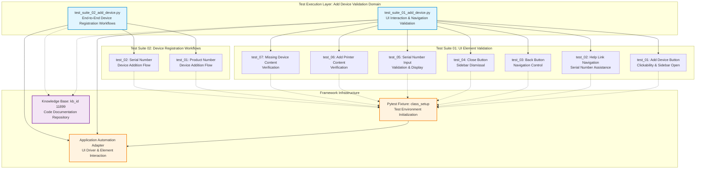

# Codebase Master Architectural Gateway

## 1. Executive System Topology

- **Core Architecture:** Specialized automated regression testing framework built on Pytest, dedicated to validating the HP Smart Desktop application's "Add Device" feature within the HPX rebranding initiative.
- **Execution Strata:** Validation boundaries are strictly partitioned by UI interaction workflows (sidebar navigation, input validation, help link redirection) and device registration methods (product number vs. serial number identification) across isolated test suites.
- **Operational Domain:** Serves as a localized quality gate for the `Framework/add_device` functional domain to ensure device addition workflows, UI element interactions, and end-to-end device registration integrity before Windows platform releases.

---

## 2. Structural Component Directory

| Layer Branch Path | Module / Target Component | Core Engineering Responsibility (Pragmatic Brief) |
| :--- | :--- | :--- |
| `tests/windows/hpx_rebranding/Framework/add_device` | `test_suite_01_add_device.py` | **Intent:** Validates UI element interactions for the "Add Device" feature including button clickability, sidebar navigation, help link redirection, back/close button functionality, serial number input validation, and content verification across device addition workflows. **Key Hooks:** `Test_Suite_01_Add_Device` class, `class_setup` fixture, test methods: `test_01_verify_add_device_button_clickable_and_opens_sidebar_page_C55687256`, `test_02_verify_navigation_of_need_help_finding_serial_number_link_C61716550`, `test_03_verify_the_back_button_for_the_add_device_C61716558`, `test_04_verify_the_close_button_for_the_add_device_C61716559`, `test_05_verify_entered_serial_number_is_accepted_and_displayed_correctly_C63813594`, `test_06_verify_the_content_in_add_a_printer_C63813978`, `test_07_verify_the_content_in_missing_a_device_C63815104`. |
| `tests/windows/hpx_rebranding/Framework/add_device` | `test_suite_02_add_device.py` | **Intent:** Validates end-to-end device registration workflows through multiple identification methods (product number and serial number), ensuring proper device discovery, selection, and successful addition to user device inventory. **Key Hooks:** `Test_Suite_02_Add_Device` class, `class_setup` fixture, test methods: `test_01_verify_device_add_via_product_number_C55687272`, `test_02_verify_device_addition_via_serial_number_C55687266`. |

---

## 3. High-Level Dependency & Propagation Matrix

### Core Architectural Anchors

- **Execution Entrypoints:** `test_suite_01_add_device.py` and `test_suite_02_add_device.py` act as the direct execution gates for the device addition validation domain, anchored by Pytest discovery mechanisms.
- **State Drivers:** Relies on underlying Pytest fixtures (`class_setup`), runtime application automation adapters, and centralized knowledge base identifiers (kb_id: 11899 tracking layer for code documentation).

### Change Propagation Profile

- **UI & Interface Churn:** Changes to the application's "Add Device" button, sidebar layout elements, help link targets, back/close controls, or serial number input fields will propagate failures directly into Suite 01. Device selection UI modifications or product/serial number entry screens will impact Suite 02. Integrating a formalized Page Object Model (POM) abstraction layer would insulate tests from visual shifts.
- **Framework Infrastructure:** Updates to central Pytest fixture configurations, shared driver initialization logic, or device discovery/registration APIs run horizontally across both suites, presenting widespread disruption risks if modified without versioned interface contracts.

---

## 4. Visual Component Topography (Mermaid)

---

## 5. System Health Check

- **Internal Coupling:** Moderate interdependence exists between test suites and shared Pytest fixture infrastructure (`class_setup`), with tight coupling to application UI element selectors and device registration API contracts.

- **Functional Cohesion:** Test suites exhibit strong single-purpose focus—Suite 01 isolates UI interaction validation while Suite 02 isolates end-to-end device registration workflows, maintaining clear functional boundaries within the device addition domain.

- **Downstream Maintainability Notes:**
  - **Page Object Model (POM) Isolation:** Implement a dedicated POM layer to abstract UI element selectors (buttons, sidebars, input fields) from test logic, reducing propagation risk during interface redesigns.
  - **Fixture Contract Versioning:** Formalize versioned contracts for `class_setup` fixture interfaces to prevent horizontal disruption across suites during framework infrastructure updates.
  - **Device Registration API Abstraction:** Introduce a service layer abstraction for device discovery and registration workflows to decouple tests from backend API implementation changes.