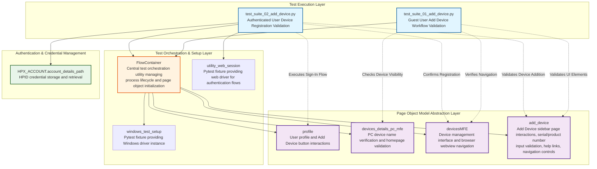

# Codebase Master Architectural Gateway

## 1. Executive System Topology

- **Core Architecture:** Specialized automated regression testing framework built on Pytest, dedicated to validating the HP Smart Desktop application's "Add Device" functionality under the HPX rebranding initiative.
- **Execution Strata:** Validation boundaries are strictly partitioned by user authentication states (guest vs. authenticated) and device addition workflow complexity profiles across isolated test suites.
- **Operational Domain:** Serves as a localized quality gate for the `Framework/add_device` functional domain to ensure UI navigation, serial number input validation, and device registration integrity before Windows platform releases.

---

## 2. Structural Component Directory

| Layer Branch Path | Module / Target Component | Core Engineering Responsibility (Pragmatic Brief) |
| :--- | :--- | :--- |
| `tests/windows/hpx_rebranding/Framework/add_device` | `test_suite_01_add_device.py` | **Intent:** Validates "Add Device" button visibility, sidebar page navigation, serial number input field behavior, help link navigation, back/close button controls, and content verification for guest user scenarios. **Key Hooks:** `Test_Suite_01_Add_Device`, `class_setup` fixture (initializes `FlowContainer`, `profile`, `devices_details_pc_mfe`, `devicesMFE`, `add_device` page objects), test methods: `test_01_verify_add_device_button_clickable_and_opens_sidebar_page_C55687256`, `test_02_verify_navigation_of_need_help_finding_serial_number_link_C61716550`, `test_03_verify_the_back_button_for_the_add_device_C61716558`, `test_04_verify_the_close_button_for_the_add_device_C61716559`, `test_05_verify_entered_serial_number_is_accepted_and_displayed_correctly_C63813594`, `test_06_verify_the_content_in_add_a_printer_C63813978`, `test_07_verify_the_content_in_missing_a_device_C63815104`. |
| `tests/windows/hpx_rebranding/Framework/add_device` | `test_suite_02_add_device.py` | **Intent:** Validates end-to-end device addition workflows for authenticated users via both product number and serial number search methods, including sign-in enforcement, input validation, and successful device registration confirmation. **Key Hooks:** `Test_Suite_02_Add_Device`, `class_setup` fixture (initializes `FlowContainer`, `profile`, `add_device`, `devicesMFE` page objects, loads HPID credentials, manages web session), test methods: `test_01_verify_device_add_via_product_number_C55687272`, `test_02_verify_device_addition_via_serial_number_C55687266`. |

---

## 3. High-Level Dependency & Propagation Matrix

### Core Architectural Anchors

- **Execution Entrypoints:** `test_suite_01_add_device.py` and `test_suite_02_add_device.py` act as the direct execution gates for the device addition validation domain.
- **State Drivers:** Relies on Pytest framework, `FlowContainer` orchestration utility, `windows_test_setup` and `utility_web_session` fixtures, Page Object Models (`profile`, `devices_details_pc_mfe`, `devicesMFE`, `add_device`), HPID credential management (`HPX_ACCOUNT.account_details_path`), and centralized knowledge base identifier (`kb_id: 12043`).

### Change Propagation Profile

- **UI & Interface Churn:** Changes to the "Add Device" button, sidebar page layout, serial number/product number input fields, help links, back/close buttons, or device name display elements will propagate failures directly into these suites. Integrating a formalized Page Object Model (POM) abstraction layer with versioned selectors would insulate tests from visual shifts.
- **Framework Infrastructure:** Updates to `FlowContainer` orchestration logic, authentication state engines (`sign_in` method), credential management utilities, or shared driver configurations run horizontally across all suites, presenting widespread disruption risks if modified without versioned interface contracts.

---

## 4. Visual Component Topography (Mermaid)

---

## 5. System Health Check

- **Internal Coupling:** Moderate coupling exists between test suites and Page Object Models, with `FlowContainer` acting as a central orchestration dependency that initializes all page objects, creating a single point of failure if modified.

- **Functional Cohesion:** Test suites exhibit strong cohesion within their bounded contexts—Suite 01 focuses exclusively on guest user UI validation workflows, while Suite 02 targets authenticated user device registration end-to-end scenarios.

- **Downstream Maintainability Notes:**
  - **Page Object Isolation:** Formalize versioned contracts for Page Object Model interfaces (`profile`, `add_device`, `devicesMFE`, `devices_details_pc_mfe`) to prevent selector changes from cascading across test suites.
  - **Credential Management Decoupling:** Extract HPID credential loading logic into a dedicated fixture or utility module to enable independent credential rotation without test suite modifications.
  - **FlowContainer Refactoring:** Consider decomposing `FlowContainer` into smaller, single-responsibility orchestration utilities to reduce blast radius during framework updates and improve testability of setup logic.