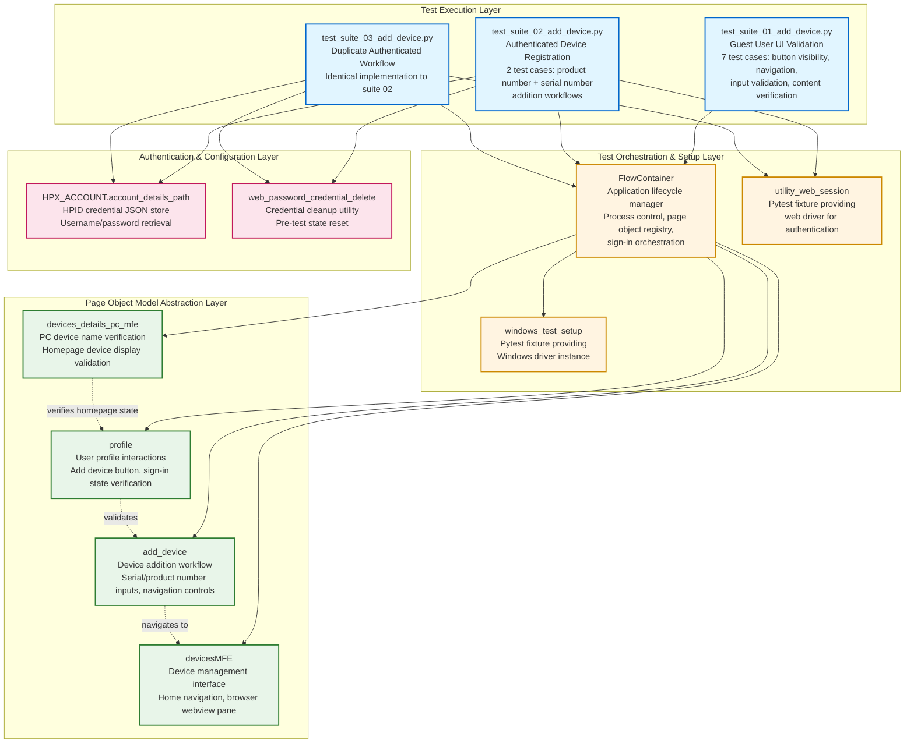

# Codebase Master Architectural Gateway

## 1. Executive System Topology

- **Core Architecture:** Pytest-based automated regression test framework targeting the HP Experience (HPX) Windows desktop application's device addition workflow within the HPX rebranding initiative.
- **Execution Strata:** Test validation boundaries are partitioned across three isolated test suites, separating guest user UI validation flows, authenticated device registration workflows, and serial/product number input validation scenarios.
- **Operational Domain:** Serves as a quality gate for the `Framework/add_device` functional domain, enforcing UI element visibility, navigation integrity, and end-to-end device registration workflows before Windows platform releases.

---

## 2. Structural Component Directory

| Layer Branch Path | Module / Target Component | Core Engineering Responsibility (Pragmatic Brief) |
| :--- | :--- | :--- |
| `tests/windows/hpx_rebranding/Framework/add_device` | `test_suite_01_add_device.py` | **Intent:** Validates "Add Device" button visibility, sidebar navigation, serial number input field interactions, help link navigation, back/close button behaviors, and informational content accuracy for guest user scenarios. **Key Hooks:** `Test_Suite_01_Add_Device`, `class_setup` fixture (initializes `FlowContainer`, `profile`, `devices_details_pc_mfe`, `devicesMFE`, `add_device` page objects), test methods: `test_01_verify_add_device_button_clickable_and_opens_sidebar_page_C55687256`, `test_02_verify_navigation_of_need_help_finding_serial_number_link_C61716550`, `test_03_verify_the_back_button_for_the_add_device_C61716558`, `test_04_verify_the_close_button_for_the_add_device_C61716559`, `test_05_verify_entered_serial_number_is_accepted_and_displayed_correctly_C63813594`, `test_06_verify_the_content_in_add_a_printer_C63813978`, `test_07_verify_the_content_in_missing_a_device_C63815104`. |
| `tests/windows/hpx_rebranding/Framework/add_device` | `test_suite_02_add_device.py` | **Intent:** Validates end-to-end authenticated device addition workflows using both product number and serial number search methods, including sign-in orchestration, input validation, and successful device registration confirmation. **Key Hooks:** `Test_Suite_02_Add_Device`, `class_setup` fixture (initializes `FlowContainer`, `profile`, `add_device`, `devicesMFE` page objects, loads HPID credentials, manages web password credential deletion), test methods: `test_01_verify_device_add_via_product_number_C55687272` (validates dual input: serial number "8CC5281Y49" + product number "9U886PA#ACJ"), `test_02_verify_device_addition_via_serial_number_C55687266` (validates single serial number input "8CC5281Y49"). |
| `tests/windows/hpx_rebranding/Framework/add_device` | `test_suite_03_add_device.py` | **Intent:** Duplicate implementation of `test_suite_02_add_device.py` validating authenticated device addition workflows via product number and serial number search methods. **Key Hooks:** `Test_Suite_02_Add_Device` (class name identical to suite 02), `class_setup` fixture (identical setup to suite 02), test methods: `test_01_verify_device_add_via_product_number_C55687272`, `test_02_verify_device_addition_via_serial_number_C55687266` (identical test logic to suite 02). |

---

## 3. High-Level Dependency & Propagation Matrix

### Core Architectural Anchors

- **Execution Entrypoints:** `test_suite_01_add_device.py`, `test_suite_02_add_device.py`, `test_suite_03_add_device.py` act as direct pytest execution gates for the device addition validation domain.
- **State Drivers:** `FlowContainer` orchestrates browser automation and application lifecycle management (process kill operations for HPX and Chrome). Page Object Model components (`profile`, `add_device`, `devices_details_pc_mfe`, `devicesMFE`) abstract UI interaction layers. HPID credential management system (`HPX_ACCOUNT.account_details_path`) drives authenticated test state initialization. `utility_web_session` fixture provides web driver instances for sign-in workflows.

### Change Propagation Profile

- **UI & Interface Churn:** Changes to "Add Device" button selectors, sidebar panel layouts, serial number/product number input field identifiers, help link elements, back/close button selectors, or device name display elements will propagate failures across all three test suites. Implementing a centralized Page Object Model (POM) with versioned selector contracts would insulate tests from UI refactoring.
- **Framework Infrastructure:** Updates to `FlowContainer` initialization logic, `sign_in` method signatures, credential loading mechanisms (`saf_misc.load_json`, `ma_misc.get_abs_path`), or page object dictionary access patterns (`fc.fd["profile"]`) run horizontally across all suites, presenting widespread disruption risks if modified without backward-compatible interface contracts. The duplicate `test_suite_03_add_device.py` amplifies maintenance burden and change propagation surface area.

---

## 4. Visual Component Topography (Mermaid)

---

## 5. System Health Check

- **Internal Coupling:** Moderate to high coupling exists between test suites and the `FlowContainer` orchestration layer, with all suites dependent on page object dictionary access patterns and shared fixture initialization logic.

- **Functional Cohesion:** Test suites demonstrate strong functional cohesion within their bounded contexts (guest UI validation vs. authenticated workflows), but `test_suite_03_add_device.py` represents redundant code duplication that degrades maintainability.

- **Downstream Maintainability Notes:**
  - **Eliminate Suite Duplication:** Consolidate or remove `test_suite_03_add_device.py` to reduce maintenance overhead and change propagation surface area.
  - **Formalize Page Object Contracts:** Extract page object interfaces into versioned contracts with explicit selector management to insulate tests from UI refactoring.
  - **Centralize Credential Management:** Abstract HPID credential loading logic into a dedicated fixture or utility module to enforce consistent authentication state initialization across suites.