# Codebase Master Architectural Gateway

## 1. Executive System Topology

- **Core Architecture:** Specialized automated regression testing framework built on Pytest, dedicated to validating the HP Smart Desktop application's device addition workflow under the HPX rebranding initiative.
- **Execution Strata:** Validation boundaries are strictly partitioned by UI interaction complexity profiles and device identification methods (serial number vs. product number) across isolated test suites.
- **Operational Domain:** Serves as a localized quality gate for the `Framework/add_device` functional domain to ensure device registration workflow integrity, UI navigation controls, and input validation before Windows platform releases.

---

## 2. Structural Component Directory

| Layer Branch Path | Module / Target Component | Core Engineering Responsibility (Pragmatic Brief) |
| :--- | :--- | :--- |
| `tests/windows/hpx_rebranding/Framework/add_device` | `test_suite_01_add_device.py` | **Intent:** Validates UI element interactions for the "Add Device" feature including button clickability, sidebar navigation, help link redirection, back/close button functionality, serial number input validation, and content verification across multiple device addition screens. **Key Hooks:** `Test_Suite_01_Add_Device` class, `class_setup` fixture, test methods: `test_01_verify_add_device_button_clickable_and_opens_sidebar_page_C55687256`, `test_02_verify_navigation_of_need_help_finding_serial_number_link_C61716550`, `test_03_verify_the_back_button_for_the_add_device_C61716558`, `test_04_verify_the_close_button_for_the_add_device_C61716559`, `test_05_verify_entered_serial_number_is_accepted_and_displayed_correctly_C63813594`, `test_06_verify_the_content_in_add_a_printer_C63813978`, `test_07_verify_the_content_in_missing_a_device_C63815104`. |
| `tests/windows/hpx_rebranding/Framework/add_device` | `test_suite_02_add_device.py` | **Intent:** Validates end-to-end device addition functionality using both product number and serial number identification methods, verifying complete device registration workflow including device discovery, selection, and successful addition confirmation. **Key Hooks:** `Test_Suite_02_Add_Device` class, `class_setup` fixture, test methods: `test_01_verify_device_add_via_product_number_C55687272`, `test_02_verify_device_addition_via_serial_number_C55687266`. |

---

## 3. High-Level Dependency & Propagation Matrix

### Core Architectural Anchors

- **Execution Entrypoints:** `test_suite_01_add_device.py` and `test_suite_02_add_device.py` act as the direct execution gates for the device addition validation domain.
- **State Drivers:** Relies on underlying test runners (Pytest), runtime application automation adapters, centralized knowledge base identifiers (`kb_id` tracking layer 11861), and class-level fixture setup mechanisms (`class_setup`) for test state initialization.

### Change Propagation Profile

- **UI & Interface Churn:** Changes to the application's "Add Device" button, sidebar layout elements, help link targets, back/close navigation controls, serial number input fields, or device selection screens will propagate failures directly into these suites. Integrating a formalized Page Object Model (POM) abstraction layer would insulate tests from visual shifts and element selector changes.
- **Framework Infrastructure:** Updates to central Pytest fixture configurations, shared driver initialization logic, or device discovery automation adapters run horizontally across all suites, presenting widespread disruption risks if modified without versioned interface contracts.

---

## 4. Visual Component Topography (Mermaid)

```mermaid
graph TB
    subgraph "Test Execution Layer: Device Addition Validation"
        A[test_suite_01_add_device.py<br/>UI Interaction & Navigation Controls]
        B[test_suite_02_add_device.py<br/>End-to-End Device Registration Workflow]
    end
    
    subgraph "Test Suite 01: UI Element Validation"
        A1[test_01: Add Device Button<br/>Clickability & Sidebar Open]
        A2[test_02: Help Link Navigation<br/>Serial Number Finder]
        A3[test_03: Back Button<br/>Navigation Control]
        A4[test_04: Close Button<br/>Sidebar Dismissal]
        A5[test_05: Serial Number Input<br/>Validation & Display]
        A6[test_06: Add Printer Content<br/>Verification]
        A7[test_07: Missing Device Content<br/>Verification]
    end
    
    subgraph "Test Suite 02: Device Registration Methods"
        B1[test_01: Product Number<br/>Device Addition Flow]
        B2[test_02: Serial Number<br/>Device Addition Flow]
    end
    
    subgraph "Framework Infrastructure"
        C[Pytest Test Runner<br/>Execution Orchestration]
        D[class_setup Fixture<br/>Test State Initialization]
        E[HP Smart Application<br/>Windows Automation Target]
        F[Knowledge Base KB-11861<br/>Test Documentation Repository]
    end
    
    A --> A1
    A --> A2
    A --> A3
    A --> A4
    A --> A5
    A --> A6
    A --> A7
    
    B --> B1
    B --> B2
    
    A --> D
    B --> D
    
    D --> E
    C --> A
    C --> B
    
    A -.-> F
    B -.-> F
    
    A1 --> E
    A2 --> E
    A3 --> E
    A4 --> E
    A5 --> E
    A6 --> E
    A7 --> E
    B1 --> E
    B2 --> E
    
    classDef testSuite fill:#e1f5ff,stroke:#0066cc,stroke-width:2px
    classDef testCase fill:#fff4e6,stroke:#ff9800,stroke-width:1px
    classDef infrastructure fill:#f3e5f5,stroke:#9c27b0,stroke-width:2px
    classDef target fill:#e8f5e9,stroke:#4caf50,stroke-width:2px
    
    class A,B testSuite
    class A1,A2,A3,A4,A5,A6,A7,B1,B2 testCase
    class C,D,F infrastructure
    class E target
```

---

## 5. System Health Check

- **Internal Coupling:** Moderate interdependence exists between test suites and the HP Smart application's UI element structure, with direct reliance on specific button identifiers, sidebar components, and input field selectors.

- **Functional Cohesion:** Test modules demonstrate strong single-purpose focus, with Suite 01 strictly validating UI interaction mechanics and Suite 02 exclusively verifying end-to-end device registration workflows through distinct identification methods.

- **Downstream Maintainability Notes:**
  - **Page Object Isolation:** Implement a dedicated Page Object Model layer to abstract UI element selectors and interaction patterns, reducing direct coupling between test logic and application DOM structure.
  - **Fixture Centralization:** Consolidate `class_setup` fixture logic into a shared configuration module to enforce consistent test state initialization across expanding test suites.
  - **Contract Locking:** Establish versioned interface contracts for device discovery and registration APIs to prevent silent breakage when underlying automation adapters or application endpoints evolve.