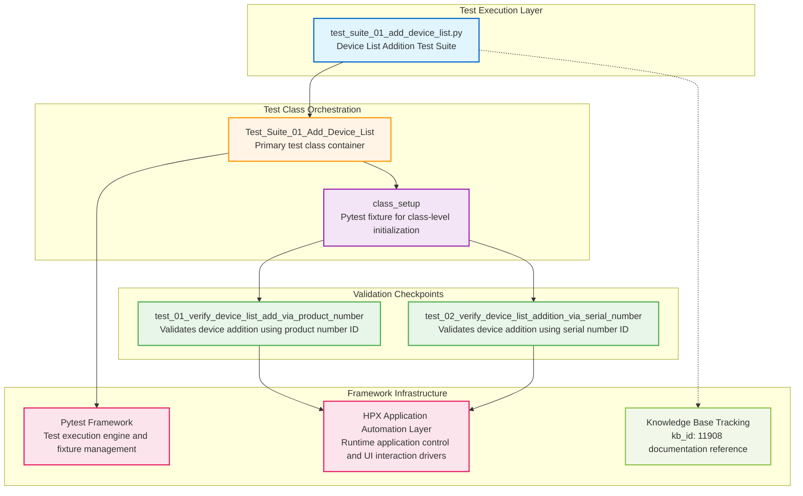

# Codebase Master Architectural Gateway

## 1. Executive System Topology

- **Core Architecture:** Specialized automated regression testing framework built on Pytest, dedicated to validating the HP Smart Desktop application's device list management functionality under the HPX rebranding initiative.
- **Execution Strata:** Validation boundaries are strictly partitioned by device identification methods (product number vs. serial number) across isolated test suites with class-level fixture orchestration.
- **Operational Domain:** Serves as a localized quality gate for the `Framework/add_device_list` functional domain to ensure device addition workflows and interface integrity before Windows platform releases.

---

## 2. Structural Component Directory

| Layer Branch Path | Module / Target Component | Core Engineering Responsibility (Pragmatic Brief) |
| :--- | :--- | :--- |
| `tests/windows/hpx_rebranding/Framework/add_device_list` | `test_suite_01_add_device_list.py` | **Intent:** Validates device list addition functionality using both product number and serial number identification methods within the HPX rebranding framework. **Key Hooks:** `Test_Suite_01_Add_Device_List`, `class_setup`, `test_01_verify_device_list_add_via_product_number_C55687299`, `test_02_verify_device_list_addition_via_serial_number_C55687277` |

---

## 3. High-Level Dependency & Propagation Matrix

### Core Architectural Anchors

- **Execution Entrypoints:** `test_suite_01_add_device_list.py` acts as the direct execution gate for the device list addition validation domain.
- **State Drivers:** Relies on underlying Pytest framework fixtures, class-level setup operations (`class_setup`), runtime application automation adapters, and centralized knowledge base identifier tracking (kb_id: 11908).

### Change Propagation Profile

- **UI & Interface Churn:** Changes to the device management interface, product number input fields, serial number entry controls, or device list display elements will propagate failures directly into these test cases. Integrating a formalized Page Object Model (POM) abstraction layer would insulate tests from visual shifts.
- **Framework Infrastructure:** Updates to central authentication state engines, shared driver configurations, or pytest fixture dependencies run horizontally across all suites, presenting widespread disruption risks if modified without versioned interface contracts.

---

## 4. Visual Component Topography (Mermaid)

---

## 5. System Health Check

- **Internal Coupling:** Moderate interdependence exists between test methods and the class-level setup fixture, with direct coupling to external application automation drivers for UI interaction execution.

- **Functional Cohesion:** Test suite maintains high single-purpose focus, strictly validating device list addition workflows through two distinct identification pathways (product number and serial number).

- **Downstream Maintainability Notes:**
  - **Page Object Isolation:** Extract device management UI selectors and interaction patterns into dedicated Page Object classes to decouple test logic from interface implementation details.
  - **Fixture Modularization:** Migrate class-level setup operations into reusable conftest.py fixtures to enable cross-suite state management and reduce duplication.
  - **Contract Locking:** Implement explicit interface contracts for application automation layer methods to prevent silent breakage when underlying driver implementations evolve.