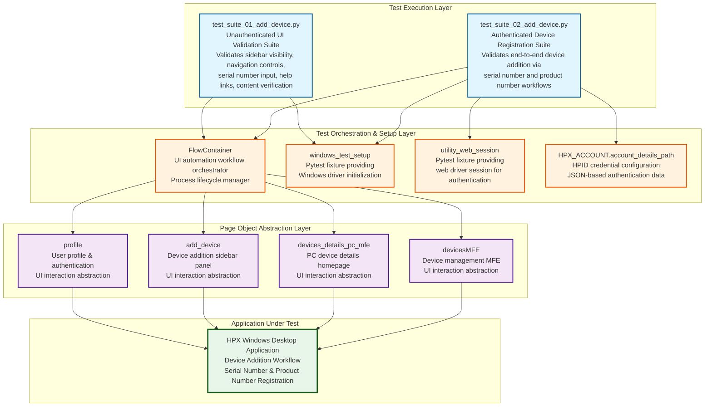

# Codebase Master Architectural Gateway

## 1. Executive System Topology

- **Core Architecture:** Pytest-based automated regression test framework targeting the HP Experience (HPX) Windows desktop application's device addition workflow within the rebranding initiative.
- **Execution Strata:** Test execution is partitioned across two isolated suites: unauthenticated UI validation flows and authenticated end-to-end device registration workflows.
- **Operational Domain:** Serves as a quality gate for the `Framework/add_device` functional domain, validating device onboarding UI components, navigation patterns, and serial number/product number registration flows before Windows platform releases.

---

## 2. Structural Component Directory

| Layer Branch Path | Module / Target Component | Core Engineering Responsibility (Pragmatic Brief) |
| :--- | :--- | :--- |
| `tests/windows/hpx_rebranding/Framework/add_device` | `test_suite_01_add_device.py` | **Intent:** Validates "Add Device" sidebar UI element visibility, navigation controls (back/close buttons), serial number input field behavior, help link navigation, and content verification for unauthenticated user states. **Key Hooks:** `Test_Suite_01_Add_Device` class, `class_setup` fixture initializing `FlowContainer`, `profile`, `devices_details_pc_mfe`, `devicesMFE`, `add_device` page objects; test methods `test_01_verify_add_device_button_clickable_and_opens_sidebar_page_C55687256`, `test_02_verify_navigation_of_need_help_finding_serial_number_link_C61716550`, `test_03_verify_the_back_button_for_the_add_device_C61716558`, `test_04_verify_the_close_button_for_the_add_device_C61716559`, `test_05_verify_entered_serial_number_is_accepted_and_displayed_correctly_C63813594`, `test_06_verify_the_content_in_add_a_printer_C63813978`, `test_07_verify_the_content_in_missing_a_device_C63815104`. |
| `tests/windows/hpx_rebranding/Framework/add_device` | `test_suite_02_add_device.py` | **Intent:** Validates end-to-end authenticated device addition workflows via both serial number and product number search methods, including user sign-in orchestration, device identifier input validation, and successful device registration confirmation. **Key Hooks:** `Test_Suite_02_Add_Device` class, `class_setup` fixture initializing `FlowContainer`, `profile`, `add_device`, `devicesMFE` page objects with HPID credential loading and web session management; test methods `test_01_verify_device_add_via_product_number_C55687272`, `test_02_verify_device_addition_via_serial_number_C55687266`. |

---

## 3. High-Level Dependency & Propagation Matrix

### Core Architectural Anchors

- **Execution Entrypoints:** `test_suite_01_add_device.py` and `test_suite_02_add_device.py` serve as direct pytest execution gates for the device addition validation domain.
- **State Drivers:** `FlowContainer` orchestrates UI automation workflows and process lifecycle management (`kill_hpx_process`, `kill_chrome_process`); `windows_test_setup` and `utility_web_session` pytest fixtures provide driver initialization; HPID credential management via `HPX_ACCOUNT.account_details_path` JSON configuration; Page object instances (`profile`, `add_device`, `devices_details_pc_mfe`, `devicesMFE`) abstract UI interaction layers.

### Change Propagation Profile

- **UI & Interface Churn:** Changes to "Add Device" sidebar layout, button identifiers (add device button, back button, close button), serial number/product number input field selectors, or help link elements will propagate failures directly across both test suites. Formalizing a centralized Page Object Model (POM) abstraction layer would insulate tests from UI selector volatility.
- **Framework Infrastructure:** Updates to `FlowContainer` orchestration logic, `windows_test_setup` fixture configuration, HPID authentication flows (`sign_in` method), or shared page object method signatures run horizontally across all device addition test cases, presenting widespread disruption risks if modified without versioned interface contracts or backward compatibility guarantees.

---

## 4. Visual Component Topography (Mermaid)

---

## 5. System Health Check

- **Internal Coupling:** Moderate coupling exists between test suites and the `FlowContainer` orchestration layer, with tight dependencies on page object method signatures and fixture initialization patterns.

- **Functional Cohesion:** Test suites exhibit strong single-purpose focus: Suite 01 isolates unauthenticated UI validation concerns, while Suite 02 isolates authenticated device registration workflows, maintaining clear functional boundaries.

- **Downstream Maintainability Notes:**
  - **Page Object Isolation:** Centralizing UI selector definitions and interaction methods within dedicated page object classes reduces test fragility against UI changes.
  - **Credential Management Hardening:** Externalizing HPID credentials to environment variables or secure vaults eliminates hardcoded JSON path dependencies and improves CI/CD portability.
  - **Fixture Contract Locking:** Versioning `FlowContainer` and page object method interfaces with explicit deprecation policies prevents cascading test failures during framework refactoring cycles.