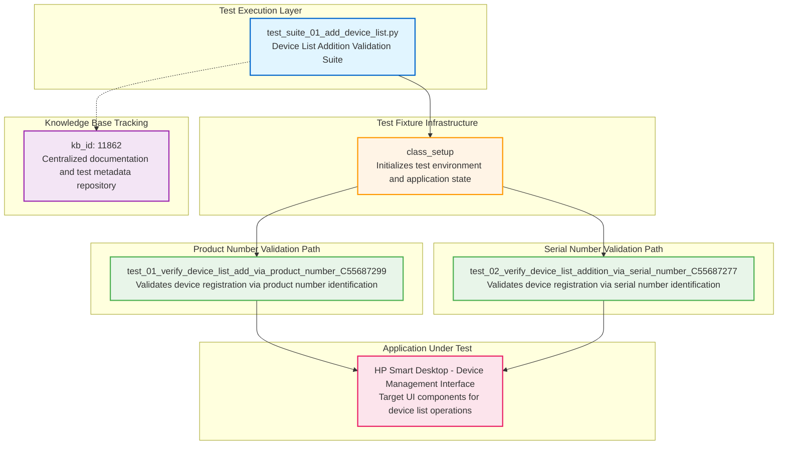

# Codebase Master Architectural Gateway

## 1. Executive System Topology

- **Core Architecture:** Specialized automated regression testing framework built on Pytest, dedicated to validating the HP Smart Desktop application's device list addition functionality under the HPX rebranding initiative.
- **Execution Strata:** Validation boundaries are strictly partitioned by device identification methods (product number vs. serial number) across isolated test scenarios within a single cohesive suite.
- **Operational Domain:** Serves as a localized quality gate for the `Framework/add_device_list` functional domain to ensure device registration, list population, and data persistence integrity before Windows platform releases.

---

## 2. Structural Component Directory

| Layer Branch Path | Module / Target Component | Core Engineering Responsibility (Pragmatic Brief) |
| :--- | :--- | :--- |
| `tests/windows/hpx_rebranding/Framework/add_device_list` | `test_suite_01_add_device_list.py` | **Intent:** Validates device list addition functionality through two distinct identification pathways: product number-based registration and serial number-based registration. Ensures proper device registration, list population, and data persistence within the application's device management interface. **Key Hooks:** `class_setup` (test fixture initialization), `test_01_verify_device_list_add_via_product_number_C55687299` (product number validation path), `test_02_verify_device_list_addition_via_serial_number_C55687277` (serial number validation path). |

---

## 3. High-Level Dependency & Propagation Matrix

### Core Architectural Anchors

- **Execution Entrypoints:** `test_suite_01_add_device_list.py` acts as the direct execution gate for the device list addition validation domain.
- **State Drivers:** Relies on underlying test runners (Pytest), runtime application automation adapters, UI-driven interaction frameworks, and centralized knowledge base identifier tracking (kb_id: 11862).

### Change Propagation Profile

- **UI & Interface Churn:** Changes to the application's device list interface elements, product number input fields, serial number entry controls, or device registration confirmation dialogs will propagate failures directly into both test scenarios. Integrating a formalized Page Object Model (POM) abstraction layer would insulate tests from visual shifts.
- **Framework Infrastructure:** Updates to central device identification engines, shared driver configurations, or authentication state managers run horizontally across all suites, presenting widespread disruption risks if modified without versioned interface contracts.

---

## 4. Visual Component Topography (Mermaid)

---

## 5. System Health Check

- **Internal Coupling:** Moderate interdependence exists between test fixture initialization (`class_setup`) and individual test scenarios, with both validation paths sharing common application state setup logic.
- **Functional Cohesion:** High cohesion maintained within the bounded context—all test functions are singularly focused on device list addition validation through distinct identification methods.
- **Downstream Maintainability Notes:**
  - **Page Object Isolation:** Implement a dedicated Page Object Model layer to abstract device list UI selectors, input field locators, and confirmation dialog interactions away from test logic.
  - **Data-Driven Expansion:** Refactor product number and serial number test cases into parameterized test fixtures to enable scalable validation across multiple device types without duplicating test structure.
  - **Contract Locking:** Establish versioned interface contracts for device identification APIs and UI automation adapters to prevent silent breakage during framework infrastructure updates.