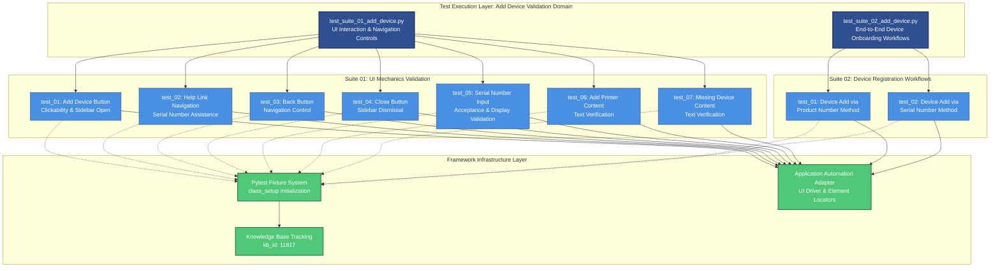

# Codebase Master Architectural Gateway

## 1. Executive System Topology

- **Core Architecture:** Specialized automated regression testing framework built on Pytest, dedicated to validating the HP Smart Desktop application's "Add Device" feature workflow under the HPX rebranding initiative.
- **Execution Strata:** Validation boundaries are partitioned across two isolated test suites—Suite 01 focuses on UI interaction mechanics and navigation controls, while Suite 02 validates end-to-end device onboarding workflows using product and serial number identification methods.
- **Operational Domain:** Serves as a localized quality gate for the `Framework/add_device` functional domain to ensure device registration UI integrity, input validation, and complete user journey execution before Windows platform releases.

---

## 2. Structural Component Directory

| Layer Branch Path | Module / Target Component | Core Engineering Responsibility (Pragmatic Brief) |
| :--- | :--- | :--- |
| `tests/windows/hpx_rebranding/Framework/add_device` | `test_suite_01_add_device.py` | **Intent:** Validates UI element interactions including Add Device button clickability, sidebar navigation, help link redirection, back/close button functionality, serial number input validation, and content verification across multiple device addition screens. **Key Hooks:** `class_setup`, `test_01_verify_add_device_button_clickable_and_opens_sidebar_page_C55687256`, `test_02_verify_navigation_of_need_help_finding_serial_number_link_C61716550`, `test_03_verify_the_back_button_for_the_add_device_C61716558`, `test_04_verify_the_close_button_for_the_add_device_C61716559`, `test_05_verify_entered_serial_number_is_accepted_and_displayed_correctly_C63813594`, `test_06_verify_the_content_in_add_a_printer_C63813978`, `test_07_verify_the_content_in_missing_a_device_C63815104`. |
| `tests/windows/hpx_rebranding/Framework/add_device` | `test_suite_02_add_device.py` | **Intent:** Validates complete device onboarding workflows by testing device addition using both product number and serial number identification methods, including device discovery, selection, and successful addition confirmation. **Key Hooks:** `class_setup`, `test_01_verify_device_add_via_product_number_C55687272`, `test_02_verify_device_addition_via_serial_number_C55687266`. |

---

## 3. High-Level Dependency & Propagation Matrix

### Core Architectural Anchors

- **Execution Entrypoints:** `test_suite_01_add_device.py` and `test_suite_02_add_device.py` act as the direct execution gates for the device addition validation domain.
- **State Drivers:** Relies on underlying Pytest test runners, runtime application automation adapters, centralized knowledge base identifier tracking (kb_id: 11817), and fixture-based test class initialization mechanisms (`class_setup` fixtures).

### Change Propagation Profile

- **UI & Interface Churn:** Changes to the Add Device button, sidebar layout elements, help link targets, back/close button selectors, serial number input fields, or content text will propagate failures directly into Suite 01. Device discovery UI shifts, product/serial number input mechanisms, or confirmation screen elements will impact Suite 02. Implementing a formalized Page Object Model (POM) abstraction layer would insulate tests from visual and selector shifts.
- **Framework Infrastructure:** Updates to central Pytest fixture configurations, shared driver initialization logic, or device identification service APIs run horizontally across both suites, presenting widespread disruption risks if modified without versioned interface contracts or backward compatibility guarantees.

---

## 4. Visual Component Topography (Mermaid)

---

## 5. System Health Check

- **Internal Coupling:** Moderate interdependence exists between test suites and the underlying Pytest fixture system, with both suites relying on shared `class_setup` initialization patterns and centralized application automation adapters for UI element interaction.

- **Functional Cohesion:** Test modules exhibit strong single-purpose focus—Suite 01 is strictly bounded to UI interaction mechanics and navigation control validation, while Suite 02 is exclusively dedicated to end-to-end device registration workflow verification using distinct identification methods.

- **Downstream Maintainability Notes:**
  - **Page Object Model (POM) Isolation:** Extracting UI element selectors and interaction logic into dedicated Page Object classes would decouple test intent from implementation details, reducing maintenance overhead when UI layouts shift.
  - **Fixture Contract Locking:** Formalizing the `class_setup` fixture interface with explicit return type contracts and versioned schemas would prevent silent breakage when shared initialization logic evolves.
  - **Device Identification Service Abstraction:** Wrapping product number and serial number lookup mechanisms behind a stable API contract would insulate Suite 02 from backend service changes and enable independent scaling of device discovery logic.