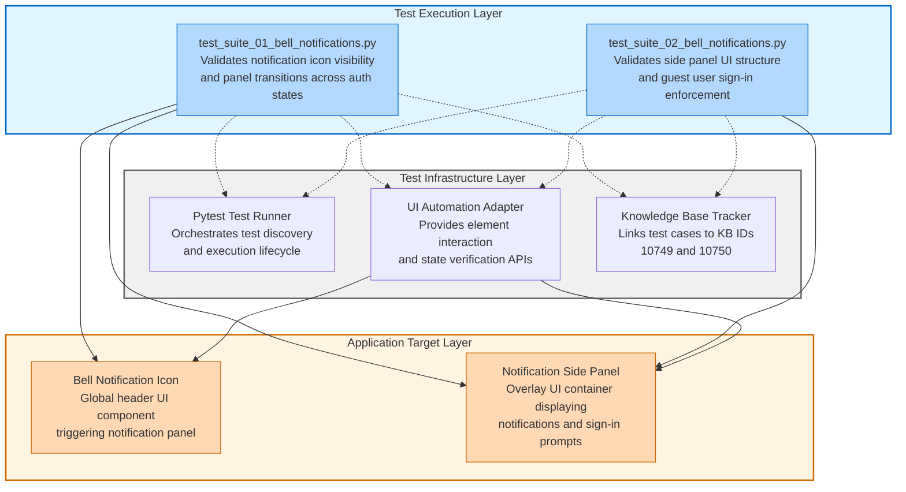

# Codebase Master Architectural Gateway

## 1. Executive System Topology

- **Core Architecture:** Specialized automated regression testing framework built on top of Pytest, dedicated to validating the HP Smart Desktop application's bell notification system under the HPX rebranding initiative.
- **Execution Strata:** Validation boundaries are strictly partitioned by user authentication states and UI interaction complexity profiles across isolated test suites.
- **Operational Domain:** Serves as a localized quality gate for the `Framework/bell_notifications` functional domain to ensure UI tracking and component integrity before Windows platform releases.

---

## 2. Structural Component Directory

| Layer Branch Path | Module / Target Component | Core Engineering Responsibility (Pragmatic Brief) |
| :--- | :--- | :--- |
| `tests/windows/hpx_rebranding/Framework/bell_notifications` | `test_suite_01_bell_notifications.py` | **Intent:** Validates global header notification icon presence, visibility, and side panel transitions for both guest and authenticated user scenarios. **Key Hooks:** `Test_Suite_01_Bell_Notifications` class containing test methods for icon visibility, panel opening mechanics, and authenticated state transitions. |
| `tests/windows/hpx_rebranding/Framework/bell_notifications` | `test_suite_02_bell_notifications.py` | **Intent:** Validates notification side panel UI layout structure, navigation close controls, and sign-in enforcement prompts for unauthenticated user states. **Key Hooks:** `Test_Suite_02_Bell_Notifications` class containing test methods for panel layout verification, close button functionality, and guest user sign-in prompt validation. |

---

## 3. High-Level Dependency & Propagation Matrix

### Core Architectural Anchors

- **Execution Entrypoints:** `test_suite_01_bell_notifications.py` and `test_suite_02_bell_notifications.py` act as the direct execution gates for the notification validation domain.
- **State Drivers:** Relies on underlying test runners (Pytest), runtime application automation adapters, and centralized knowledge base identifiers (`kb_id` tracking layers 10749 and 10750).

### Change Propagation Profile

- **UI & Interface Churn:** Changes to the application's global header layout elements, side-panel titles, or close buttons will propagate failures directly into these suites. Integrating a formalized Page Object Model (POM) abstraction layer would insulate tests from visual shifts.
- **Framework Infrastructure:** Updates to central authentication state engines or shared driver configurations run horizontally across all suites, presenting widespread disruption risks if modified without versioned interface contracts.

---

## 4. Visual Component Topography (Mermaid)

---

## 5. System Health Check

- **Internal Coupling:** Test suites exhibit tight coupling to specific UI element selectors and application state transitions, creating fragility when interface implementations shift without corresponding test updates.

- **Functional Cohesion:** Modules demonstrate strong single-purpose focus, with Suite 01 handling icon and panel mechanics while Suite 02 isolates layout validation and authentication boundary enforcement.

- **Downstream Maintainability Notes:**
  - **Page Object Isolation:** Extract UI element selectors and interaction patterns into dedicated Page Object classes to decouple test logic from DOM structure changes.
  - **Authentication State Fixtures:** Centralize user authentication state setup into reusable Pytest fixtures to eliminate redundant login/logout sequences across suites.
  - **Contract-Based UI Validation:** Implement explicit interface contracts for notification panel components to enable parallel UI refactoring without breaking test assertions.