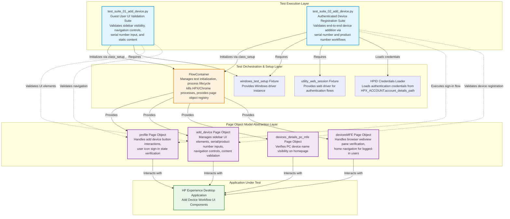

# Codebase Master Architectural Gateway

## 1. Executive System Topology

- **Core Architecture:** Pytest-based automated regression test framework targeting the HP Experience (HPX) Windows desktop application's device addition workflow under the HPX rebranding initiative.
- **Execution Strata:** Test execution is partitioned across two isolated suites: guest user UI validation flows and authenticated user end-to-end device registration workflows with serial number and product number input validation.
- **Operational Domain:** Serves as a quality gate for the `Framework/add_device` functional domain, enforcing UI element visibility, navigation integrity, and device registration workflow validation before Windows platform releases.

---

## 2. Structural Component Directory

| Layer Branch Path | Module / Target Component | Core Engineering Responsibility (Pragmatic Brief) |
| :--- | :--- | :--- |
| `tests/windows/hpx_rebranding/Framework/add_device` | `test_suite_01_add_device.py` | **Intent:** Validates "Add Device" sidebar UI element visibility, navigation controls (back/close buttons), help link navigation, serial number input field behavior, and static content verification for guest/unauthenticated user states. **Key Hooks:** `Test_Suite_01_Add_Device`, `class_setup` fixture (initializes `FlowContainer`, `profile`, `devices_details_pc_mfe`, `devicesMFE`, `add_device` page objects), test methods: `test_01_verify_add_device_button_clickable_and_opens_sidebar_page_C55687256`, `test_02_verify_navigation_of_need_help_finding_serial_number_link_C61716550`, `test_03_verify_the_back_button_for_the_add_device_C61716558`, `test_04_verify_the_close_button_for_the_add_device_C61716559`, `test_05_verify_entered_serial_number_is_accepted_and_displayed_correctly_C63813594`, `test_06_verify_the_content_in_add_a_printer_C63813978`, `test_07_verify_the_content_in_missing_a_device_C63815104`. |
| `tests/windows/hpx_rebranding/Framework/add_device` | `test_suite_02_add_device.py` | **Intent:** Validates end-to-end authenticated device addition workflows via both serial number-only and combined serial number + product number search methods, including sign-in orchestration, input validation, and successful device registration confirmation. **Key Hooks:** `Test_Suite_02_Add_Device`, `class_setup` fixture (initializes `FlowContainer`, `profile`, `add_device`, `devicesMFE` page objects, loads HPID credentials, clears web password credentials), test methods: `test_01_verify_device_add_via_product_number_C55687272`, `test_02_verify_device_addition_via_serial_number_C55687266`. |

---

## 3. High-Level Dependency & Propagation Matrix

### Core Architectural Anchors

- **Execution Entrypoints:** `test_suite_01_add_device.py` and `test_suite_02_add_device.py` serve as direct pytest execution gates for the device addition validation domain.
- **State Drivers:** `FlowContainer` orchestrates test initialization and process lifecycle management (kills HPX/Chrome processes). Page Object Models (`profile`, `add_device`, `devices_details_pc_mfe`, `devicesMFE`) abstract UI interaction layers. `utility_web_session` fixture provides web driver instances for authentication flows. HPID credential loading via `HPX_ACCOUNT.account_details_path` drives authenticated test scenarios.

### Change Propagation Profile

- **UI & Interface Churn:** Changes to "Add Device" sidebar layout, button selectors (add device button, back button, close button), serial number/product number input fields, help link elements, or device name display components will propagate failures directly into both test suites. Implementing a centralized Page Object Model (POM) contract with versioned element locators would insulate tests from UI refactoring.
- **Framework Infrastructure:** Updates to `FlowContainer` initialization logic, `sign_in` authentication flows, credential management utilities (`web_password_credential_delete`), or shared page object base classes run horizontally across all device addition suites, presenting widespread disruption risks if modified without backward-compatible interface contracts. Changes to pytest fixture scopes or `windows_test_setup` configuration will impact all test class initialization sequences.

---

## 4. Visual Component Topography (Mermaid)

---

## 5. System Health Check

- **Internal Coupling:** Moderate coupling exists between test suites and the `FlowContainer` orchestration layer, with tight dependencies on page object registry (`fc.fd`) for runtime component access. Test methods exhibit sequential coupling through repeated navigation patterns (verify → click → assert chains).

- **Functional Cohesion:** Test suites demonstrate strong functional cohesion within their bounded contexts: Suite 01 focuses exclusively on guest user UI validation, while Suite 02 isolates authenticated device registration workflows. Each test method validates a single, well-defined user interaction scenario.

- **Downstream Maintainability Notes:**
  - **Page Object Isolation:** Migrate hardcoded element selectors and interaction patterns from test methods into dedicated page object methods to reduce UI churn propagation surface area.
  - **Credential Management Abstraction:** Extract HPID credential loading logic into a reusable fixture or utility module to enable centralized credential rotation and environment-specific configuration management.
  - **Assertion Message Standardization:** Implement a centralized assertion message template system to ensure consistent failure diagnostics across test suites and reduce maintenance overhead during UI element renaming.