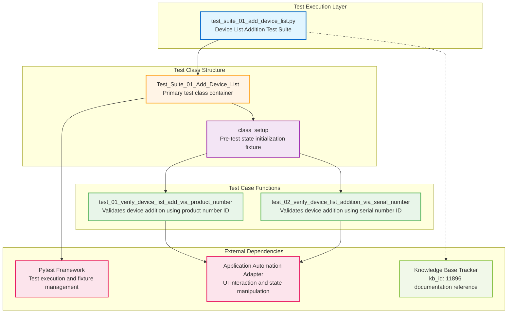

# Codebase Master Architectural Gateway

## 1. Executive System Topology

- **Core Architecture:** Specialized automated regression testing framework built on Pytest, dedicated to validating the HP Smart Desktop application's device management workflows under the HPX rebranding initiative.
- **Execution Strata:** Validation boundaries are strictly partitioned by device identification methods (product number vs. serial number) across isolated test case functions within a unified suite class.
- **Operational Domain:** Serves as a localized quality gate for the `Framework/add_device_list` functional domain to ensure device registration and list population integrity before Windows platform releases.

---

## 2. Structural Component Directory

| Layer Branch Path | Module / Target Component | Core Engineering Responsibility (Pragmatic Brief) |
| :--- | :--- | :--- |
| `tests/windows/hpx_rebranding/Framework/add_device_list` | `test_suite_01_add_device_list.py` | **Intent:** Validates device list addition functionality using both product number and serial number identification workflows, ensuring successful device registration and list population. **Key Hooks:** `Test_Suite_01_Add_Device_List` (class), `class_setup` (fixture), `test_01_verify_device_list_add_via_product_number_C55687299`, `test_02_verify_device_list_addition_via_serial_number_C55687277`. |

---

## 3. High-Level Dependency & Propagation Matrix

### Core Architectural Anchors

- **Execution Entrypoints:** `test_suite_01_add_device_list.py` acts as the direct execution gate for device list addition validation domain, anchored by the `Test_Suite_01_Add_Device_List` class.
- **State Drivers:** Relies on underlying test runners (Pytest), runtime application automation adapters, centralized knowledge base identifier tracking (kb_id: 11896), and `class_setup` fixture for pre-test state initialization.

### Change Propagation Profile

- **UI & Interface Churn:** Changes to the application's device management interface elements, input field selectors for product numbers or serial numbers, or device list display components will propagate failures directly into both test cases. Integrating a formalized Page Object Model (POM) abstraction layer would insulate tests from visual shifts.
- **Framework Infrastructure:** Updates to central authentication state engines, shared driver configurations, or device identification validation logic run horizontally across all device management suites, presenting widespread disruption risks if modified without versioned interface contracts.

---

## 4. Visual Component Topography (Mermaid)

---

## 5. System Health Check

- **Internal Coupling:** Moderate interdependence exists between test cases and the application's device management UI layer, with direct reliance on element selectors and input field availability for both product number and serial number workflows.

- **Functional Cohesion:** High cohesion within the bounded context—the module maintains strict focus on device list addition validation with clear separation between identification method test paths (product number vs. serial number).

- **Downstream Maintainability Notes:**
  - **Page Object Isolation:** Extract device management UI interactions into dedicated Page Object classes to decouple test logic from selector volatility and enable reusable component abstractions across device-related test suites.
  - **Fixture Centralization:** Migrate `class_setup` logic into shared conftest.py fixtures to enable cross-suite state initialization and reduce duplication if device management tests expand.
  - **Contract Locking:** Implement explicit interface contracts or API mocks for device identification validation logic to prevent upstream framework changes from cascading failures into regression suites without versioned compatibility checks.