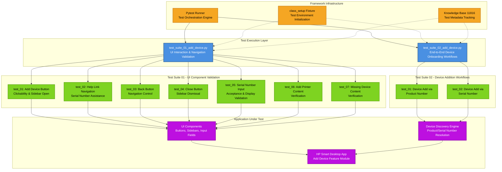

# Codebase Master Architectural Gateway

## 1. Executive System Topology

- **Core Architecture:** Pytest-based automated regression testing framework targeting the HP Smart Desktop application's "Add Device" feature under the HPX rebranding initiative.
- **Execution Strata:** Test validation is partitioned across two isolated suites: UI interaction/navigation validation (Suite 01) and end-to-end device onboarding workflows (Suite 02).
- **Operational Domain:** Serves as a quality gate for the `Framework/add_device` functional domain, ensuring device discovery, serial number validation, and UI component integrity before Windows platform releases.

---

## 2. Structural Component Directory

| Layer Branch Path | Module / Target Component | Core Engineering Responsibility (Pragmatic Brief) |
| :--- | :--- | :--- |
| `tests/windows/hpx_rebranding/Framework/add_device` | `test_suite_01_add_device.py` | **Intent:** Validates UI element interactions including add device button clickability, sidebar navigation, help link redirection, back/close button functionality, serial number input validation, and content verification across device addition workflows. **Key Hooks:** `class_setup`, `test_01_verify_add_device_button_clickable_and_opens_sidebar_page_C55687256`, `test_02_verify_navigation_of_need_help_finding_serial_number_link_C61716550`, `test_03_verify_the_back_button_for_the_add_device_C61716558`, `test_04_verify_the_close_button_for_the_add_device_C61716559`, `test_05_verify_entered_serial_number_is_accepted_and_displayed_correctly_C63813594`, `test_06_verify_the_content_in_add_a_printer_C63813978`, `test_07_verify_the_content_in_missing_a_device_C63815104` |
| `tests/windows/hpx_rebranding/Framework/add_device` | `test_suite_02_add_device.py` | **Intent:** Validates complete device addition workflows using both product number and serial number identification methods, verifying device discovery, selection, and successful addition to the user's device list. **Key Hooks:** `class_setup`, `test_01_verify_device_add_via_product_number_C55687272`, `test_02_verify_device_addition_via_serial_number_C55687266` |

---

## 3. High-Level Dependency & Propagation Matrix

### Core Architectural Anchors

- **Execution Entrypoints:** `test_suite_01_add_device.py` and `test_suite_02_add_device.py` act as the direct execution gates for the add device validation domain.
- **State Drivers:** Relies on Pytest fixtures (`class_setup`), runtime application automation adapters, and centralized knowledge base identifier tracking (kb_id: 11816).

### Change Propagation Profile

- **UI & Interface Churn:** Changes to the add device button, sidebar layout, help links, back/close controls, serial number input fields, or content labels will propagate failures directly into Suite 01. Device selection UI modifications will impact Suite 02. Implementing a Page Object Model (POM) abstraction layer would insulate tests from visual shifts.
- **Framework Infrastructure:** Updates to central Pytest fixture configurations, shared driver initialization logic, or device discovery automation adapters run horizontally across both suites, presenting widespread disruption risks if modified without versioned interface contracts.

---

## 4. Visual Component Topography (Mermaid)

---

## 5. System Health Check

- **Internal Coupling:** Moderate interdependence exists between test suites and UI automation adapters, with shared fixture dependencies creating horizontal coupling across the test execution layer.
- **Functional Cohesion:** Test modules exhibit strong single-purpose focus, with Suite 01 strictly validating UI interactions and Suite 02 exclusively testing device onboarding workflows.
- **Downstream Maintainability Notes:**
  - Implement Page Object Model (POM) abstraction to isolate UI element selectors from test logic, reducing brittleness against interface changes.
  - Formalize fixture contracts with versioned interfaces to prevent cascading failures during framework infrastructure updates.
  - Extract device discovery automation logic into reusable utility modules to enable cross-suite consistency and reduce duplication risk.