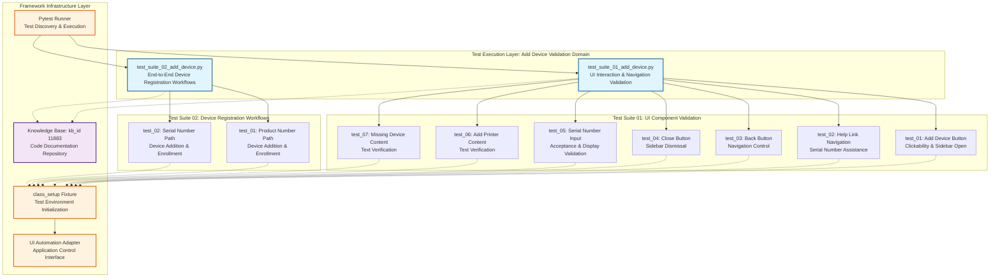

# Codebase Master Architectural Gateway

## 1. Executive System Topology

- **Core Architecture:** Specialized automated regression testing framework built on Pytest, dedicated to validating the HP Smart Desktop application's "Add Device" feature under the HPX rebranding initiative.
- **Execution Strata:** Validation boundaries are strictly partitioned by UI interaction complexity profiles (button clickability, sidebar navigation, input validation) and device identification methods (product number vs. serial number) across isolated test suites.
- **Operational Domain:** Serves as a localized quality gate for the `Framework/add_device` functional domain to ensure device registration workflows, UI navigation patterns, and input validation integrity before Windows platform releases.

---

## 2. Structural Component Directory

| Layer Branch Path | Module / Target Component | Core Engineering Responsibility (Pragmatic Brief) |
| :--- | :--- | :--- |
| `tests/windows/hpx_rebranding/Framework/add_device` | `test_suite_01_add_device.py` | **Intent:** Validates UI interaction patterns for the "Add Device" feature including button clickability, sidebar navigation flows, help link redirections, serial number input validation, content verification, and close/back button functionality. **Key Hooks:** `Test_Suite_01_Add_Device` class containing 7 test methods: `test_01_verify_add_device_button_clickable_and_opens_sidebar_page_C55687256`, `test_02_verify_navigation_of_need_help_finding_serial_number_link_C61716550`, `test_03_verify_the_back_button_for_the_add_device_C61716558`, `test_04_verify_the_close_button_for_the_add_device_C61716559`, `test_05_verify_entered_serial_number_is_accepted_and_displayed_correctly_C63813594`, `test_06_verify_the_content_in_add_a_printer_C63813978`, `test_07_verify_the_content_in_missing_a_device_C63815104`. Fixture: `class_setup`. |
| `tests/windows/hpx_rebranding/Framework/add_device` | `test_suite_02_add_device.py` | **Intent:** Validates end-to-end device registration workflows through multiple identification methods, specifically testing device addition via product number and serial number input paths with successful enrollment confirmation. **Key Hooks:** `Test_Suite_02_Add_Device` class containing 2 test methods: `test_01_verify_device_add_via_product_number_C55687272`, `test_02_verify_device_addition_via_serial_number_C55687266`. Fixture: `class_setup`. |

---

## 3. High-Level Dependency & Propagation Matrix

### Core Architectural Anchors

- **Execution Entrypoints:** `test_suite_01_add_device.py` and `test_suite_02_add_device.py` act as the direct execution gates for the device addition validation domain, anchored by Pytest discovery mechanisms.
- **State Drivers:** Relies on underlying test runners (Pytest), runtime application automation adapters, centralized knowledge base identifiers (kb_id: 11883), and shared `class_setup` fixtures for test environment initialization and state management.

### Change Propagation Profile

- **UI & Interface Churn:** Changes to the application's "Add Device" button, sidebar layout elements, help link targets, serial number input fields, or content text will propagate failures directly into both test suites. Integrating a formalized Page Object Model (POM) abstraction layer would insulate tests from visual shifts and element selector changes.
- **Framework Infrastructure:** Updates to central fixture configurations (`class_setup`), shared driver configurations, or device identification validation engines run horizontally across all suites, presenting widespread disruption risks if modified without versioned interface contracts or backward compatibility guarantees.

---

## 4. Visual Component Topography (Mermaid)

---

## 5. System Health Check

- **Internal Coupling:** Moderate interdependence exists between test suites and shared fixture infrastructure (`class_setup`), with tight coupling to UI element selectors and application automation adapters requiring coordinated updates during interface changes.

- **Functional Cohesion:** Test modules demonstrate strong single-purpose focus with clear separation of concerns—Suite 01 isolates UI component validation while Suite 02 focuses exclusively on end-to-end device registration workflows.

- **Downstream Maintainability Notes:**
  - **Page Object Model (POM) Adoption:** Implement a dedicated POM layer to abstract UI element selectors and navigation logic, reducing direct coupling between test assertions and application interface changes.
  - **Fixture Contract Versioning:** Establish explicit versioning contracts for `class_setup` fixtures to prevent cascading failures when shared initialization logic evolves.
  - **Device Identification Abstraction:** Extract product number and serial number validation logic into reusable utility modules to enable consistent device identification testing across expanded test coverage domains.