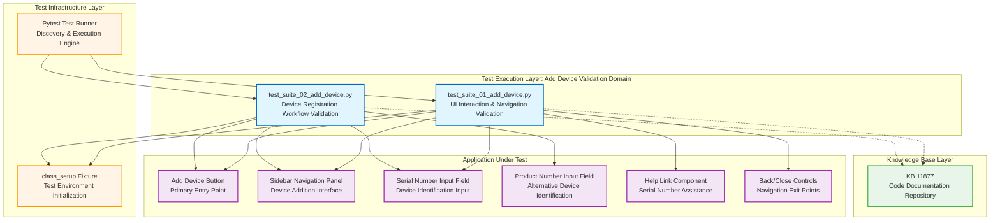

# Codebase Master Architectural Gateway

## 1. Executive System Topology

- **Core Architecture:** Specialized automated regression testing framework built on Pytest, dedicated to validating the HP Smart Desktop application's device addition workflow under the HPX rebranding initiative.
- **Execution Strata:** Validation boundaries are strictly partitioned by UI interaction complexity profiles and device identification method variants (product number vs. serial number) across isolated test suites.
- **Operational Domain:** Serves as a localized quality gate for the `Framework/add_device` functional domain to ensure device registration workflow integrity, navigation controls, and input validation before Windows platform releases.

---

## 2. Structural Component Directory

| Layer Branch Path | Module / Target Component | Core Engineering Responsibility (Pragmatic Brief) |
| :--- | :--- | :--- |
| `tests/windows/hpx_rebranding/Framework/add_device` | `test_suite_01_add_device.py` | **Intent:** Validates complete UI interaction patterns for the "Add Device" feature including button clickability, sidebar navigation, help link redirection, back/close button functionality, serial number input validation, and content verification across multiple device addition scenarios. **Key Hooks:** `Test_Suite_01_Add_Device` class, `class_setup` fixture, test methods: `test_01_verify_add_device_button_clickable_and_opens_sidebar_page_C55687256`, `test_02_verify_navigation_of_need_help_finding_serial_number_link_C61716550`, `test_03_verify_the_back_button_for_the_add_device_C61716558`, `test_04_verify_the_close_button_for_the_add_device_C61716559`, `test_05_verify_entered_serial_number_is_accepted_and_displayed_correctly_C63813594`, `test_06_verify_the_content_in_add_a_printer_C63813978`, `test_07_verify_the_content_in_missing_a_device_C63815104`. |
| `tests/windows/hpx_rebranding/Framework/add_device` | `test_suite_02_add_device.py` | **Intent:** Validates device addition functionality using both product number and serial number identification methods, implementing automated UI-driven test cases that verify the complete device registration workflow, input validation, and successful device enrollment confirmation. **Key Hooks:** `Test_Suite_02_Add_Device` class, `class_setup` fixture, test methods: `test_01_verify_device_add_via_product_number_C55687272`, `test_02_verify_device_addition_via_serial_number_C55687266`. |

---

## 3. High-Level Dependency & Propagation Matrix

### Core Architectural Anchors

- **Execution Entrypoints:** `test_suite_01_add_device.py` and `test_suite_02_add_device.py` act as the direct execution gates for the device addition validation domain, anchored by Pytest discovery and `class_setup` fixture initialization.
- **State Drivers:** Relies on underlying Pytest test runners, runtime application automation adapters, and centralized knowledge base identifiers (kb_id: 11877 tracking layer for code documentation).

### Change Propagation Profile

- **UI & Interface Churn:** Changes to the application's "Add Device" button, sidebar layout elements, help link targets, back/close navigation controls, or serial number input fields will propagate failures directly into these suites. Integrating a formalized Page Object Model (POM) abstraction layer would insulate tests from visual shifts and element selector volatility.
- **Framework Infrastructure:** Updates to central Pytest fixture configurations, shared driver initialization logic, or device identification validation engines run horizontally across all suites, presenting widespread disruption risks if modified without versioned interface contracts or backward compatibility guarantees.

---

## 4. Visual Component Topography (Mermaid)

---

## 5. System Health Check

- **Internal Coupling:** Test suites exhibit moderate coupling to application UI element selectors and navigation flow sequences, with direct dependencies on sidebar panel structure, button availability, and input field behavior.

- **Functional Cohesion:** Modules demonstrate strong single-purpose focus with clear separation of concerns—Suite 01 isolates UI interaction mechanics and navigation controls, while Suite 02 isolates end-to-end device registration workflows by identification method.

- **Downstream Maintainability Notes:**
  - **Page Object Model (POM) Isolation:** Implement centralized Page Object abstractions to decouple element selectors from test logic, reducing maintenance burden when UI layouts shift during HPX rebranding iterations.
  - **Fixture Standardization:** Formalize `class_setup` fixture contracts with explicit interface definitions to prevent cascading failures when shared initialization logic evolves.
  - **Test Data Externalization:** Extract hardcoded serial numbers, product numbers, and expected content strings into external configuration files or data fixtures to enable rapid test data updates without code modifications.