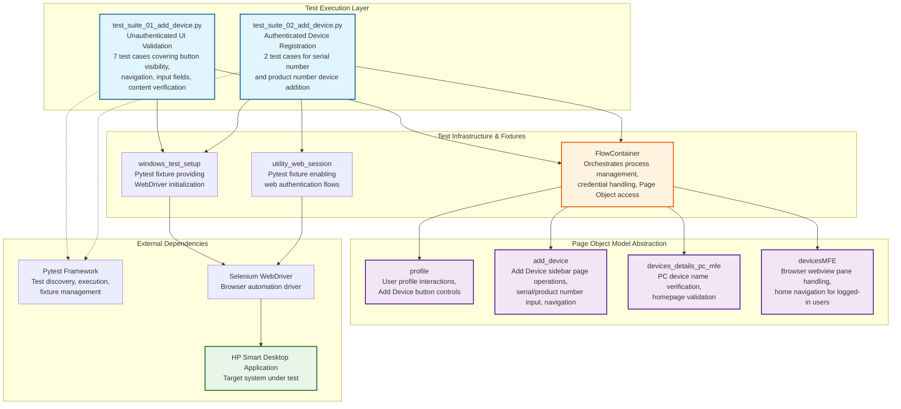

# Codebase Master Architectural Gateway

## 1. Executive System Topology

- **Core Architecture:** Pytest-based automated regression testing framework targeting the HP Experience (HPX) rebranding initiative's "Add Device" functionality on Windows desktop platforms.
- **Execution Strata:** Test execution is partitioned across two distinct suites: unauthenticated UI validation flows (Suite 01) and authenticated end-to-end device registration workflows (Suite 02).
- **Operational Domain:** Serves as a quality gate for the `Framework/add_device` functional domain, validating device addition workflows including serial number input, product number search, UI navigation controls, and content verification before Windows platform releases.

---

## 2. Structural Component Directory

| Layer Branch Path | Module / Target Component | Core Engineering Responsibility (Pragmatic Brief) |
| :--- | :--- | :--- |
| `tests/windows/hpx_rebranding/Framework/add_device` | `test_suite_01_add_device.py` | **Intent:** Validates unauthenticated user flows for Add Device UI components including button visibility, sidebar navigation, serial number input fields, help link navigation, back/close controls, and static content verification. **Key Hooks:** `Test_Suite_01_Add_Device` class, `class_setup` fixture, test methods `test_01` through `test_07` covering UI element presence, navigation flows, input acceptance, and content validation (C55687256, C61716550, C61716558, C61716559, C63813594, C63813978, C63815104). |
| `tests/windows/hpx_rebranding/Framework/add_device` | `test_suite_02_add_device.py` | **Intent:** Validates authenticated user device registration workflows via both product number and serial number search mechanisms, including end-to-end sign-in flows, input validation, and successful device addition confirmation. **Key Hooks:** `Test_Suite_02_Add_Device` class, `class_setup` fixture with `utility_web_session` for authentication, `test_01_verify_device_add_via_product_number_C55687272`, `test_02_verify_device_addition_via_serial_number_C55687266`. |

---

## 3. High-Level Dependency & Propagation Matrix

### Core Architectural Anchors

- **Execution Entrypoints:** `test_suite_01_add_device.py` (7 test cases) and `test_suite_02_add_device.py` (2 test cases) serve as direct pytest execution gates for the add device validation domain.
- **State Drivers:** `FlowContainer` orchestrates test setup and teardown (process killing, credential management), `windows_test_setup` fixture provides driver initialization, `utility_web_session` fixture enables web-based authentication flows, Page Object Model components (`profile`, `add_device`, `devices_details_pc_mfe`, `devicesMFE`) abstract UI interaction layers.

### Change Propagation Profile

- **UI & Interface Churn:** Changes to Add Device sidebar layout, button selectors, input field identifiers, help link targets, or content text will propagate failures directly across both suites. Serial number/product number textbox locators and newly added device name verification are tightly coupled to UI element structure.
- **Framework Infrastructure:** Updates to `FlowContainer` initialization logic, `windows_test_setup` fixture configuration, authentication credential management (`web_password_credential_delete`, `sign_in` flows), or Page Object Model interface contracts (`fc.fd` dictionary structure) will cascade horizontally across all test cases, presenting widespread disruption risk without versioned abstraction layers.

---

## 4. Visual Component Topography (Mermaid)

---

## 5. System Health Check

- **Internal Coupling:** Moderate coupling exists between test suites and Page Object Model components accessed via `FlowContainer.fd` dictionary lookups, creating implicit dependency on key naming conventions and object availability.

- **Functional Cohesion:** Test suites exhibit strong single-purpose focus with Suite 01 strictly validating unauthenticated UI elements and Suite 02 exclusively handling authenticated device registration workflows, maintaining clear separation of concerns.

- **Downstream Maintainability Notes:**
  - **Page Object Isolation:** Formalizing Page Object Model interfaces with explicit contracts (typed method signatures, documented return values) would reduce brittleness from internal implementation changes.
  - **Fixture Dependency Injection:** Extracting `FlowContainer` initialization logic into dedicated fixture factories would enable independent testing of setup/teardown behaviors and improve test isolation.
  - **Selector Externalization:** Moving UI element selectors (button locators, textbox identifiers, content text expectations) into centralized configuration files or data fixtures would insulate test logic from UI rebranding churn and enable rapid bulk updates.