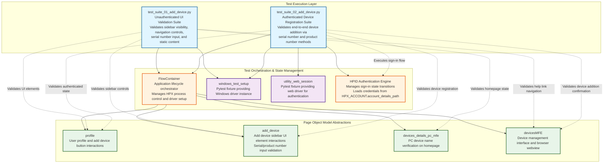

# Codebase Master Architectural Gateway

## 1. Executive System Topology

- **Core Architecture:** Pytest-based automated regression test framework targeting the HP Experience (HPX) Windows desktop application's device addition workflow under the HPX rebranding initiative.
- **Execution Strata:** Test execution is partitioned across two isolated suites: unauthenticated UI validation flows and authenticated end-to-end device registration scenarios with serial number and product number input validation.
- **Operational Domain:** Serves as a quality gate for the `Framework/add_device` functional domain, enforcing UI element visibility, navigation integrity, and device registration workflow validation before Windows platform releases.

---

## 2. Structural Component Directory

| Layer Branch Path | Module / Target Component | Core Engineering Responsibility (Pragmatic Brief) |
| :--- | :--- | :--- |
| `tests/windows/hpx_rebranding/Framework/add_device` | `test_suite_01_add_device.py` | **Intent:** Validates "Add Device" sidebar UI element visibility, navigation controls (back/close buttons), help link routing, serial number input acceptance, and static content verification for unauthenticated user states. **Key Hooks:** `Test_Suite_01_Add_Device`, `class_setup` fixture, page object dependencies (`FlowContainer`, `profile`, `devices_details_pc_mfe`, `devicesMFE`, `add_device`), test methods: `test_01_verify_add_device_button_clickable_and_opens_sidebar_page_C55687256`, `test_02_verify_navigation_of_need_help_finding_serial_number_link_C61716550`, `test_03_verify_the_back_button_for_the_add_device_C61716558`, `test_04_verify_the_close_button_for_the_add_device_C61716559`, `test_05_verify_entered_serial_number_is_accepted_and_displayed_correctly_C63813594`, `test_06_verify_the_content_in_add_a_printer_C63813978`, `test_07_verify_the_content_in_missing_a_device_C63815104`. |
| `tests/windows/hpx_rebranding/Framework/add_device` | `test_suite_02_add_device.py` | **Intent:** Validates authenticated device addition workflows via both serial number and product number search methods, including HPID sign-in orchestration, input field validation, device registration confirmation, and newly added device name display verification. **Key Hooks:** `Test_Suite_02_Add_Device`, `class_setup` fixture with `utility_web_session` for authentication, HPID credential loading from `HPX_ACCOUNT.account_details_path`, page object dependencies (`FlowContainer`, `profile`, `add_device`, `devicesMFE`), test methods: `test_01_verify_device_add_via_product_number_C55687272`, `test_02_verify_device_addition_via_serial_number_C55687266`. |

---

## 3. High-Level Dependency & Propagation Matrix

### Core Architectural Anchors

- **Execution Entrypoints:** `test_suite_01_add_device.py` (unauthenticated UI validation gate) and `test_suite_02_add_device.py` (authenticated device registration gate) serve as the primary test execution anchors for the add_device domain.
- **State Drivers:** `FlowContainer` orchestrates application lifecycle management (process kill/restart), `windows_test_setup` and `utility_web_session` pytest fixtures provide driver initialization, HPID authentication engine manages sign-in state transitions, page object models (`profile`, `add_device`, `devices_details_pc_mfe`, `devicesMFE`) abstract UI element interactions.

### Change Propagation Profile

- **UI & Interface Churn:** Changes to the "Add Device" sidebar layout, button selectors (add device, back, close), serial number/product number input field identifiers, help link URLs, or device name display elements will propagate failures across both test suites. Implementing a centralized Page Object Model (POM) with versioned element locator contracts would insulate tests from UI refactoring.
- **Framework Infrastructure:** Updates to `FlowContainer` orchestration logic, pytest fixture signatures (`windows_test_setup`, `utility_web_session`), HPID authentication flows, or credential loading mechanisms (`HPX_ACCOUNT.account_details_path`) run horizontally across all suites, presenting widespread disruption risk if modified without backward-compatible interface contracts.

---

## 4. Visual Component Topography (Mermaid)

---

## 5. System Health Check

- **Internal Coupling:** Moderate coupling exists between test suites and page object model abstractions (`profile`, `add_device`, `devices_details_pc_mfe`, `devicesMFE`), with tight dependency on `FlowContainer` for application lifecycle orchestration and driver initialization.

- **Functional Cohesion:** Test suites exhibit strong single-purpose cohesion, with `test_suite_01` strictly focused on unauthenticated UI validation and `test_suite_02` dedicated to authenticated device registration workflows, ensuring clear separation of concerns.

- **Downstream Maintainability Notes:**
  - **Page Object Isolation:** Centralizing UI element locators within page object models reduces test brittleness against UI refactoring; consider implementing versioned locator strategies or CSS selector contracts.
  - **Credential Management:** Externalizing HPID credentials via `HPX_ACCOUNT.account_details_path` enables environment-specific configuration; enforce encrypted credential storage and rotation policies for production test environments.
  - **Fixture Dependency Contracts:** Formalizing pytest fixture interfaces (`windows_test_setup`, `utility_web_session`) with explicit type hints and docstrings will prevent signature drift and enable safer refactoring of test infrastructure components.